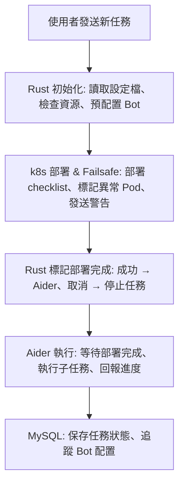

# lucas152112/aider_project_start

**Description**: aider專案開發啟動工具(rust)

**Primary Language**: Shell

**Created**: 2026-03-03T07:17:42Z
**Last Updated**: 2026-03-05T16:08:55Z
**Stars**: 0 | **Forks**: 0
**Archived**: False

## Language Statistics

| Language | Bytes | Percentage |
|----------|-------|------------|
| Shell | 3,798 | 100.0% |

## Repository Information

- **GitHub URL**: https://github.com/lucas152112/aider_project_start
- **SSH URL**: git@github.com:lucas152112/aider_project_start.git
- **Clone URL**: https://github.com/lucas152112/aider_project_start.git

## System Architecture

### Overview

This project uses a modular architecture with the following technology stack:

| Language | Bytes | Percentage |
|----------|-------|------------|
| Shell | 3,798 | 100.0% |

### Key Components

1. **Core Application** - Main business logic and functionality
2. **Data Layer** - Database and data access components
3. **API Layer** - RESTful or GraphQL interfaces
4. **Client Interface** - User-facing applications or services

### Deployment

- **Containerization**: Docker-based deployment
- **Orchestration**: Kubernetes for scalable deployment
- **CI/CD**: Automated testing and deployment pipeline

### Dependencies

- See package manager files for detailed dependencies
## README Content

```
aider任務執行系統
# Rust + MySQL + Discord Bot + Aider 系統流程圖

此文件展示了完整的 **Rust 控制層 + MySQL 任務追蹤 + Discord Bot + Aider 執行 + k8s 部署檢查** 流程。  
流程涵蓋：

- 任務初始化與 Bot 配置  
- 資源門檻檢查  
- 部署檢查 / Failsafe  
- Aider 任務執行  
- ORM MySQL 安全操作  
- 任務資料庫與 Bot 配置管理

---

## Mermaid 流程圖



---

## 流程說明

1. **Rust 初始化層**  
   - 讀取設定檔、檢查 cluster 資源  
   - 配置任務專屬 Discord Bot  
   - 生成 task_plan，存入 MySQL  
   - 人工確認是否開始任務

2. **k8s 部署 & Failsafe**  
   - 延遲檢查部署狀態  
   - 根據 checklist 驗證 Pod / Service / Volume  
   - 部署異常發送 Discord 通知，人工決策：取消或忽略

3. **Rust 標記部署完成**  
   - 成功 → Aider 開始任務  
   - 取消 → 停止流程、刪除 Pod

4. **Aider 執行層**  
   - 等待 Rust 部署完成確認  
   - 執行子任務並回報進度  
   - Discord 訊息使用 Rust 配置的 Bot  
   - 異常通知 / 人工決策

5. **MySQL 系統開發資料庫**  
   - ORM 安全操作，追蹤任務狀態  
   - 保存 bot_name / token  
   - 避免重複執行 repo

---

## MySQL 資料庫與資料表設計

### 1. 建立資料庫
```sql
CREATE DATABASE IF NOT EXISTS system_tasks CHARACTER SET utf8mb4 COLLATE utf8mb4_unicode_ci;
```

### 2. 任務表 (repo_tasks)
```sql
CREATE TABLE IF NOT EXISTS repo_tasks (
    task_id INT AUTO_INCREMENT PRIMARY KEY,
    repo_url VARCHAR(255) NOT NULL,
    agent_id VARCHAR(50) NOT NULL,
    bot_name VARCHAR(50) NOT NULL,
    status ENUM('pending','in_progress','completed','cancelled') NOT NULL DEFAULT 'pending',
    created_at DATETIME NOT NULL DEFAULT CURRENT_TIMESTAMP,
    started_at DATETIME NULL,
    completed_at DATETIME NULL,
    last_update DATETIME NULL,
    UNIQUE KEY unique_repo (repo_url)
) ENGINE=InnoDB DEFAULT CHARSET=utf8mb4;
```

### 3. Bot 配置表 (bots)
```sql
CREATE TABLE IF NOT EXISTS bots (
    bot_id INT AUTO_INCREMENT PRIMARY KEY,
    bot_name VARCHAR(50) NOT NULL,
    token VARCHAR(255) NOT NULL,
    prefix VARCHAR(10) NOT NULL DEFAULT '#
```
