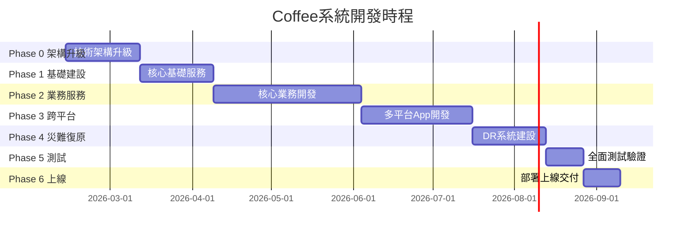

# ☕ Coffee連鎖咖啡館管理系統 - 完整專案文件

## 📋 **文件總覽**

### **專案基本資訊**
- **專案名稱**: Coffee連鎖咖啡館管理系統 (Coffee Chain Management System)
- **專案類型**: 企業級管理系統 (CRM + ERP雙系統)
- **開發模式**: 敏捷開發 (2週Sprint)
- **符合標準**: 系統開發基本規範 (14微服務+AI助手+跨平台+災難復原)

---

## 📄 **1. 需求文件 (Requirements Document)**

### **1.1 業務需求**

#### **系統目標**
1. **提升營運效率**: 自動化咖啡館日常營運流程
2. **優化客戶體驗**: 快速點餐、個性化服務、會員管理
3. **強化數據分析**: 銷售分析、庫存預測、財務管控
4. **支援規模擴展**: 多門店管理、標準化流程

#### **核心業務場景**
1. **門店營運** (CRM系統):
   - POS點餐系統: 商品選擇、客製化、結帳
   - 客戶管理: 會員註冊、積分管理、個人化推薦
   - 庫存管理: 即時庫存、自動補貨提醒
   - 日常報表: 銷售統計、熱門商品分析

2. **總部管理** (ERP系統):
   - 多門店管理: 門店績效、統一配置
   - 供應鏈管理: 供應商管理、採購計劃、成本控制
   - 財務管理: 收支分析、利潤計算、預算管控
   - 策略分析: 市場趨勢、營運洞察、決策支援

### **1.2 功能需求**

#### **CRM門店系統功能**
```yaml
POS點餐系統:
  - 商品瀏覽與選擇
  - 客製化選項 (糖度、冰度、加料)
  - 購物車管理
  - 多種支付方式 (現金/信用卡/行動支付)
  - 發票列印
  
客戶管理:
  - 會員註冊與登入
  - 個人資料管理
  - 消費記錄查詢
  - 積分累積與兌換
  - 生日優惠與推播
  
庫存管理:
  - 即時庫存查詢
  - 商品入庫出庫
  - 庫存不足警示
  - 報廢品管理
  - 盤點功能
  
門店報表:
  - 日銷售報表
  - 商品銷售排行
  - 客流量統計
  - 營收趨勢分析
```

#### **ERP總部系統功能**
```yaml
門店管理:
  - 門店基本資料
  - 營業時間設定
  - 人員配置管理
  - 績效考核
  - 設備管理
  
供應鏈管理:
  - 供應商資料管理
  - 採購計劃制定
  - 採購訂單管理
  - 收貨驗收
  - 供應商評估
  
財務管理:
  - 收支記錄
  - 成本分析
  - 利潤計算
  - 預算管控
  - 財務報表
  
營運分析:
  - 多門店對比分析
  - 市場趨勢分析
  - 客戶行為分析
  - 商品組合分析
  - 營運效率分析
```

### **1.3 技術需求**

#### **性能需求**
- **並發用戶**: 支援1000+同時在線用戶
- **回應時間**: API回應<150ms，頁面載入<2秒
- **可用性**: 系統可用性>99.5%
- **擴展性**: 支援水平擴展，彈性資源調整

#### **安全需求**
- **身份認證**: JWT Token + 多因素認證
- **權限控制**: RBAC角色權限管理
- **資料加密**: 敏感資料加密存儲
- **審計日誌**: 完整操作記錄與追蹤
- **災難復原**: 自動備份與快速恢復

#### **跨平台需求**
- **Web平台**: 響應式設計，支援主流瀏覽器
- **移動端**: Android APK + iOS App
- **桌面端**: Windows exe + macOS dmg + Linux AppImage
- **離線功能**: PWA離線支援，資料同步

#### **AI智能需求**
- **智能助手**: 全域浮動AI按鈕
- **自然語言查詢**: "今日銷售如何？" "哪些商品庫存不足？"
- **語音輸入**: 支援語音指令操作
- **權限控制**: AI查詢嚴格遵循使用者權限
- **多模型支援**: GPT/Claude/Gemini可切換

---

## 📅 **2. 開發計劃 (Development Plan)**

### **2.1 總體時程安排**

#### **開發週期**: 7個月 (30週)
#### **開發階段**: 6個Phase漸進式交付



### **2.2 詳細開發階段**

#### **Phase 0: 架構升級階段** (第1-4週)
**目標**: 建立符合系統開發規範的完整架構

**第1週: 技術架構升級規劃**
- Rust技術棧遷移計劃
- 多資料庫整合設計  
- AI服務架構設計
- 災難復原系統設計
- 跨平台打包方案

**第2週: 開發環境重建**
- Rust開發環境配置
- 多資料庫Docker配置
- 14個微服務基礎架構
- 6環境Git分支建立
- CI/CD流水線升級

**第3週: 資料庫架構升級**
- MySQL核心業務資料遷移
- Redis快取層實作
- MongoDB文檔資料設計
- 資料庫智能路由器
- 備份策略實施

**第4週: AI服務基礎建設**
- AI服務框架搭建
- 多AI模型整合
- 權限控制機制
- 語音輸入支援
- 前端AI元件

#### **Phase 1: 核心基礎建設** (第5-8週)
**目標**: 建立系統核心基礎服務

**關鍵交付物**:
- API Gateway (Rust + Axum)
- 認證授權服務 (JWT + RBAC)
- 審計日誌服務
- 檔案管理服務
- 工作流程引擎
- 全域AI智能助手

#### **Phase 2: 業務核心服務** (第9-16週)
**目標**: 開發完整業務功能

**微服務開發順序**:
1. **Customer + Sales Service** (客戶與銷售)
2. **Inventory + Purchase Service** (庫存與採購)
3. **Finance + Supplier Service** (財務與供應商)
4. **Report + Notification Service** (報表與通知)

#### **Phase 3: 跨平台擴展** (第17-22週)
**目標**: 實現5平台支援

**平台開發計劃**:
- **移動端**: Capacitor + Android/iOS
- **桌面端**: Electron + Windows/macOS/Linux
- **Web端**: PWA + 離線支援

#### **Phase 4: 災難復原與監控** (第23-26週)
**目標**: 建立企業級災難復原能力

**DR系統建設**:
- 租戶獨立備份系統
- 自動災難恢復機制
- K8s彈性擴展
- 完整監控審計系統

#### **Phase 5: 整合測試** (第27-28週)
**目標**: 全面品質保證

**測試範圍**:
- 5平台功能測試
- AI助手全面測試
- 災難復原驗證
- 安全合規檢查

#### **Phase 6: 部署上線** (第29-30週)
**目標**: 正式生產部署

**上線準備**:
- 生產環境配置
- 使用者培訓
- 驗收測試
- 專案交付

### **2.3 團隊資源配置**

#### **核心開發團隊** (10-12人)
```yaml
管理層:
  - 專案經理 × 1: 整體協調、進度管控

後端開發:
  - Rust工程師 × 3-4: 微服務開發
  - AI工程師 × 1: AI助手開發

前端開發:
  - 前端工程師 × 2: CRM/ERP介面
  - 移動端工程師 × 1: App開發

基礎設施:
  - DevOps工程師 × 1: CI/CD、K8s
  - 測試工程師 × 1: 品質保證

外部支援:
  - 資料庫專家: 效能調優
  - 安全專家: 安全審查
  - 災難復原專家: DR系統
```

### **2.4 里程碑與交付物**

| 里程碑 | 時間 | 關鍵交付物 | 驗收標準 |
|--------|------|-----------|----------|
| M0 | 第4週 | 架構升級完成 | 14個微服務框架+AI基礎 |
| M1 | 第8週 | 基礎服務完成 | 核心基礎設施可用 |
| M2 | 第16週 | 業務服務完成 | 完整業務流程可運行 |
| M3 | 第22週 | 跨平台完成 | 5平台功能一致 |
| M4 | 第26週 | 災難復原完成 | DR系統測試通過 |
| M5 | 第28週 | 測試完成 | 全面測試通過 |
| M6 | 第30週 | 正式上線 | 生產系統穩定運行 |

---

## 🏗️ **3. 系統架構文件 (Architecture Document)**

### **3.1 微服務架構**

#### **14個標準微服務**
```
coffee-microservices/
├── 🔐 auth-service/              # 認證授權
├── 👥 customer-service/          # 客戶管理
├── 💰 sales-service/             # 銷售管理
├── 📦 inventory-service/         # 庫存管理
├── 🛒 purchase-service/          # 採購管理
├── 💳 finance-service/           # 財務管理
├── 🏭 supplier-service/          # 供應商管理
├── 📊 report-service/            # 報表分析
├── 🔔 notification-service/      # 通知服務
├── 📝 audit-service/             # 審計日誌
├── 📁 file-service/              # 檔案管理
├── ⚙️ workflow-service/          # 工作流程
├── 🌐 gateway-service/           # API閘道
└── 🤖 ai-chat-service/           # AI智能助手
```

### **3.2 技術架構**

#### **後端技術棧**
- **語言**: Rust
- **框架**: Axum (高效能Web框架)
- **資料庫**: MySQL 8.0 + Redis + MongoDB
- **訊息佇列**: NATS
- **容器**: Docker + Kubernetes

#### **前端技術棧**
- **框架**: Nuxt.js 3 + Vue.js 3
- **語言**: TypeScript
- **UI庫**: Ant Design Vue
- **狀態管理**: Pinia
- **AI助手**: 全域浮動元件

#### **跨平台技術**
- **移動端**: Capacitor (Android + iOS)
- **桌面端**: Electron (Windows + macOS + Linux)
- **Web端**: PWA (離線支援)

### **3.3 資料庫架構**

#### **多資料庫智能分配**
```yaml
MySQL 8.0 (關聯式資料):
  - 客戶資料 (customers, members)
  - 訂單資料 (orders, order_items)
  - 商品資料 (products, categories)
  - 財務資料 (transactions, accounting)
  - 庫存資料 (inventory, stock_movements)
  - 供應商資料 (suppliers, purchase_orders)

Redis (記憶體快取):
  - 使用者會話 (JWT tokens)
  - API回應快取
  - 即時庫存計數器
  - 分散式鎖機制
  - 熱點資料快取

MongoDB (文檔資料):
  - AI對話記錄
  - 系統操作日誌
  - 審計追蹤資料
  - 監控指標資料
  - 非結構化設定檔
```

---

## 🧪 **4. 測試計劃 (Test Plan)**

### **4.1 測試策略**

#### **測試層級**
1. **單元測試**: 每個微服務>85%覆蓋率
2. **整合測試**: 服務間API測試
3. **系統測試**: 端到端業務流程測試
4. **AI測試**: 智能助手功能測試
5. **跨平台測試**: 5平台一致性測試
6. **災難復原測試**: DR機制驗證

#### **測試工具**
- **後端**: Rust內建測試框架
- **前端**: Jest + Cypress
- **API**: Postman + Newman
- **效能**: Artillery + K6
- **安全**: OWASP ZAP

### **4.2 測試案例設計**

#### **功能測試案例** (預估500+案例)
```yaml
認證授權測試:
  - 使用者登入登出
  - JWT Token驗證
  - 角色權限控制
  - 多因素認證

業務流程測試:
  - 完整點餐流程
  - 會員積分累積兌換
  - 庫存補貨流程
  - 採購審核流程
  - 財務結算流程

AI助手測試:
  - 自然語言查詢
  - 語音輸入識別
  - 權限控制驗證
  - 多模型切換

跨平台測試:
  - 功能一致性驗證
  - 資料同步測試
  - 離線功能測試
  - 效能對比測試
```

---

## 🚀 **5. 部署計劃 (Deployment Plan)**

### **5.1 部署架構**

#### **Kubernetes生產環境**
```yaml
環境配置:
  - 開發環境 (dev): 2 nodes, 基礎配置
  - 測試環境 (test): 2 nodes, 生產模擬
  - 預發布環境 (pp): 3 nodes, 生產配置
  - 生產環境 (prod): 5+ nodes, 高可用配置

資源配置:
  - 每個微服務: 2-4個Pod副本
  - 資源限制: CPU 1-2核, 記憶體 2-4GB
  - 自動擴展: HPA + VPA
  - 儲存: SSD + 網路儲存
```

### **5.2 CI/CD流水線**

#### **自動化部署流程**
```yaml
觸發條件:
  - 程式碼推送到指定分支
  - Pull Request合併
  - 手動觸發部署

部署步驟:
  1. 程式碼檢出與建置
  2. 單元測試執行
  3. Docker映像建置
  4. 安全掃描檢查
  5. 部署到目標環境
  6. 健康檢查驗證
  7. 測試套件執行
  8. 部署結果通知
```

### **5.3 災難復原計劃**

#### **備份策略**
- **資料庫**: 每日全備份 + 每小時增量備份
- **檔案系統**: 即時同步到異地
- **配置檔案**: 版本控制管理
- **容器映像**: 多區域複製

#### **恢復機制**
- **RTO (恢復時間目標)**: <30分鐘
- **RPO (恢復點目標)**: <1小時
- **自動故障切換**: 健康檢查 + 自動切換
- **資料完整性**: 自動驗證 + 手動確認

---

## 📊 **6. 品質保證計劃 (Quality Assurance Plan)**

### **6.1 程式碼品質標準**

#### **程式碼規範**
- **後端**: Rust官方風格指南
- **前端**: ESLint + Prettier配置
- **命名規範**: 統一英文命名
- **註解規範**: 函數和複雜邏輯必須註解
- **程式碼審查**: 所有PR必須經過審查

#### **品質指標**
- **程式碼品質**: SonarQube評分>A級
- **測試覆蓋率**: 後端>85%, 前端>75%
- **技術債務**: <5%
- **重複程式碼**: <3%
- **複雜度**: 圈複雜度<10

### **6.2 效能品質標準**

#### **效能指標**
- **API回應時間**: P95 < 150ms
- **頁面載入時間**: < 2秒
- **AI回應時間**: < 3秒
- **資料庫查詢**: < 100ms
- **並發處理**: 1000+ TPS

#### **可用性指標**
- **系統可用性**: >99.5%
- **災難恢復時間**: <30分鐘
- **錯誤率**: <0.1%
- **資料完整性**: 100%

---

## 📝 **7. 風險管理計劃 (Risk Management Plan)**

### **7.1 技術風險**

| 風險項目 | 風險等級 | 影響 | 緩解措施 |
|----------|----------|------|----------|
| Rust技術學習曲線 | 中 | 開發進度延遲 | 團隊培訓、專家諮詢 |
| 微服務複雜度 | 高 | 整合困難 | 標準化架構、完整測試 |
| AI模型整合 | 中 | 功能不穩定 | 多模型備份、降級機制 |
| 跨平台相容性 | 中 | 功能差異 | 早期測試、統一標準 |
| 災難復原複雜 | 高 | 系統不可用 | 定期演練、自動化流程 |

### **7.2 專案風險**

| 風險項目 | 風險等級 | 影響 | 緩解措施 |
|----------|----------|------|----------|
| 需求變更 | 中 | 進度影響 | 敏捷開發、版本控制 |
| 人員異動 | 高 | 知識流失 | 文件化、知識分享 |
| 整合問題 | 中 | 交付延遲 | 持續整合、早期測試 |
| 品質問題 | 中 | 返工成本 | 嚴格測試、程式碼審查 |

---

## 💰 **8. 預算與成本估算**

### **8.1 開發成本**

#### **人力成本** (7個月)
```yaml
核心團隊 (10人):
  - 專案經理: 1人 × 7個月 = 7人月
  - Rust工程師: 4人 × 7個月 = 28人月  
  - 前端工程師: 2人 × 7個月 = 14人月
  - 移動端工程師: 1人 × 7個月 = 7人月
  - AI工程師: 1人 × 7個月 = 7人月
  - DevOps工程師: 1人 × 7個月 = 7人月
  - 測試工程師: 1人 × 7個月 = 7人月
  
總計: 77人月
```

#### **基礎設施成本**
```yaml
開發環境:
  - 雲端伺服器: K8s集群開發測試
  - 資料庫服務: MySQL + Redis + MongoDB
  - CI/CD工具: GitHub Actions
  - 監控工具: Prometheus + Grafana
  
生產環境:
  - 高可用K8s集群
  - 多區域備份
  - 災難復原系統
  - 安全防護服務
```

### **8.2 營運成本**

#### **持續營運** (年度)
- **雲端基礎設施**: 伺服器、儲存、網路
- **第三方服務**: AI API、支付閘道、簡訊服務
- **維護支援**: 系統維護、技術支援
- **安全服務**: 安全監控、合規審查

---

## 📈 **9. 成功指標與驗收標準**

### **9.1 技術指標**

| 指標類別 | 具體指標 | 目標值 | 測量方式 |
|----------|----------|--------|----------|
| 程式碼品質 | SonarQube評分 | >A級 | 自動掃描 |
| 測試覆蓋率 | 後端/前端 | >85%/>75% | 測試報告 |
| API效能 | 回應時間P95 | <150ms | 效能監控 |
| 系統可用性 | 正常運行時間 | >99.5% | 監控統計 |
| AI回應 | 查詢回應時間 | <3秒 | 使用者體驗監控 |

### **9.2 業務指標**

| 指標類別 | 具體指標 | 目標值 | 測量方式 |
|----------|----------|--------|----------|
| 功能完整性 | 需求實現率 | 100% | 功能檢查清單 |
| 使用者滿意度 | 驗收滿意度 | >4.0/5.0 | 使用者回饋 |
| 跨平台一致性 | 功能一致率 | >95% | 平台對比測試 |
| 災難恢復 | 恢復時間 | <30分鐘 | DR演練測試 |

### **9.3 專案指標**

| 指標類別 | 具體指標 | 目標值 | 測量方式 |
|----------|----------|--------|----------|
| 進度達成 | 里程碑準時率 | >95% | 專案追蹤 |
| 預算控制 | 成本偏差率 | <10% | 財務監控 |
| 品質指標 | 生產Bug密度 | <1個/KLOC | 缺陷統計 |
| 交付品質 | 驗收通過率 | >90% | 驗收測試 |

---

## 📋 **10. 驗收檢查清單**

### **10.1 功能驗收**

#### **CRM系統** (門店)
- [ ] POS點餐系統完整流程
- [ ] 客戶管理與會員服務
- [ ] 庫存管理與補貨提醒  
- [ ] 門店報表與分析
- [ ] AI智能助手功能

#### **ERP系統** (總部)
- [ ] 多門店管理功能
- [ ] 供應鏈管理完整流程
- [ ] 財務管理與分析
- [ ] 營運報表與商業智慧
- [ ] AI輔助決策功能

#### **跨平台支援**
- [ ] Web響應式設計
- [ ] Android App功能
- [ ] iOS App功能  
- [ ] Windows桌面版
- [ ] macOS桌面版
- [ ] Linux桌面版
- [ ] PWA離線功能

### **10.2 技術驗收**

#### **系統架構**
- [ ] 14個微服務正常運行
- [ ] API Gateway路由正確
- [ ] 服務間通訊穩定
- [ ] 資料庫讀寫正常
- [ ] 快取機制有效

#### **AI功能**
- [ ] 全域AI助手可用
- [ ] 自然語言查詢準確
- [ ] 語音輸入識別正確
- [ ] 權限控制有效
- [ ] 多模型切換正常

#### **災難復原**
- [ ] 自動備份機制
- [ ] 災難恢復測試通過
- [ ] 資料完整性驗證
- [ ] 監控告警正常
- [ ] 恢復時間符合要求

### **10.3 品質驗收**

#### **效能指標**
- [ ] API回應時間<150ms
- [ ] 頁面載入時間<2秒
- [ ] 並發處理1000+ TPS
- [ ] 系統可用性>99.5%
- [ ] 記憶體使用率<80%

#### **安全指標**
- [ ] 身份認證機制
- [ ] 權限控制完整
- [ ] 資料加密保護
- [ ] 安全漏洞掃描通過
- [ ] 審計日誌完整

---

**📋 文件編制**: 芊芊AI助手  
**📅 編制日期**: 2026-02-12  
**📝 文件版本**: v1.0  
**🎯 符合標準**: 系統開發基本規範完整版  
**⚠️ 審核狀態**: 待老大審核確認

---

**🌱 老大，Coffee系統的完整需求文件和開發計劃已編制完成！**

這份文件包含了從需求分析到部署上線的所有必要內容，完全符合系統開發基本規範。請審核確認是否可以進入下一階段的具體實施工作！