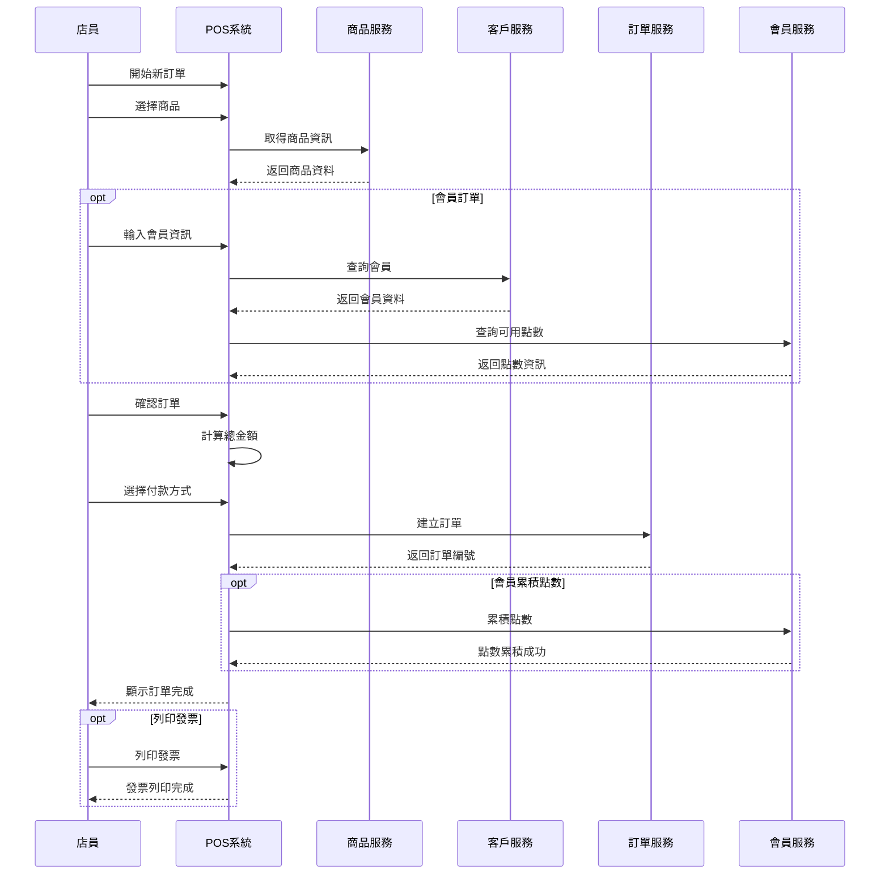
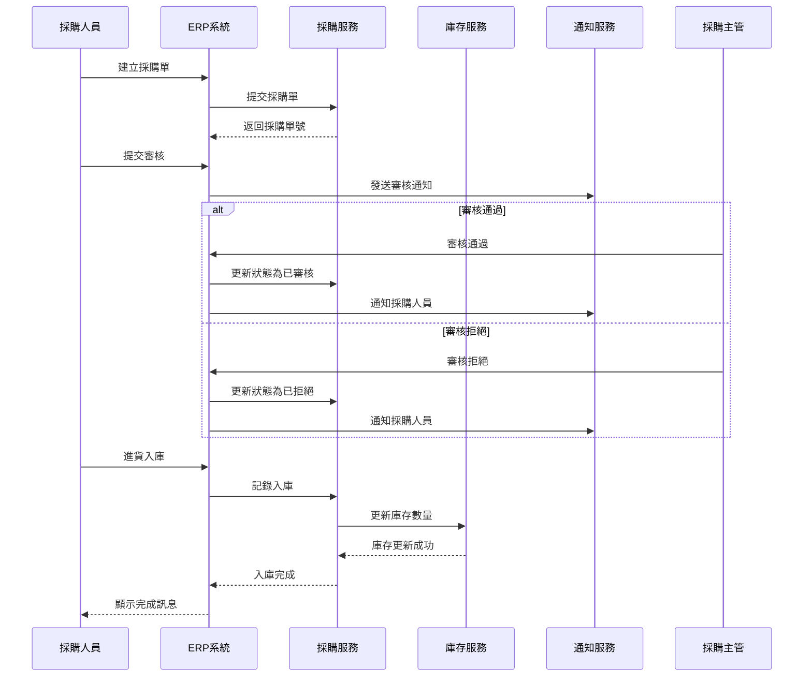

# 使用案例圖 (Use Case Diagram)

## 1. 系統總覽使用案例圖

```mermaid
graph TB
    subgraph "咖啡館連鎖管理系統"
        subgraph "CRM 門店管理"
            UC1[商品點餐]
            UC2[訂單結帳]
            UC3[客戶管理]
            UC4[會員查詢]
            UC5[點數管理]
            UC6[門店報表]
        end
        
        subgraph "ERP 總部管理"
            UC7[商品管理]
            UC8[庫存管理]
            UC9[採購管理]
            UC10[供應商管理]
            UC11[門店管理]
            UC12[營收報表]
            UC13[銷售分析]
            UC14[客戶分析]
        end
        
        subgraph "系統管理"
            UC15[用戶管理]
            UC16[權限管理]
            UC17[系統設定]
            UC18[通知管理]
        end
    end
    
    Actor1[店員] --> UC1
    Actor1 --> UC2
    Actor1 --> UC4
    
    Actor2[店長] --> UC3
    Actor2 --> UC5
    Actor2 --> UC6
    Actor2 --> UC1
    Actor2 --> UC2
    
    Actor3[總部採購] --> UC7
    Actor3 --> UC8
    Actor3 --> UC9
    Actor3 --> UC10
    
    Actor4[總部管理層] --> UC11
    Actor4 --> UC12
    Actor4 --> UC13
    Actor4 --> UC14
    
    Actor5[系統管理員] --> UC15
    Actor5 --> UC16
    Actor5 --> UC17
    Actor5 --> UC18
    
    Actor6[會員] -.-> UC2
    Actor6 -.-> UC5
```



---

## 2. CRM 門店管理使用案例圖

```mermaid
graph LR
    subgraph "CRM 門店管理系統"
        UC1[下訂單]
        UC2[修改訂單]
        UC3[取消訂單]
        UC4[結帳付款]
        UC5[列印發票]
        UC6[新增客戶]
        UC7[編輯客戶]
        UC8[查詢客戶]
        UC9[查看消費記錄]
        UC10[查詢會員點數]
        UC11[累積點數]
        UC12[兌換點數]
        UC13[查看門店日報]
        UC14[查看銷售排行]
    end
    
    店員((店員)) --> UC1
    店員 --> UC2
    店員 --> UC3
    店員 --> UC4
    店員 --> UC5
    店員 --> UC8
    店員 --> UC10
    
    店長((店長)) --> UC6
    店長 --> UC7
    店長 --> UC8
    店長 --> UC9
    店長 --> UC11
    店長 --> UC12
    店長 --> UC13
    店長 --> UC14
    
    會員((會員)) -.查詢.-> UC10
    
    UC4 ..> UC11 : <<include>>
    UC4 ..> UC5 : <<extend>>
    UC1 ..> UC8 : <<include>>
```

---

## 3. ERP 總部管理使用案例圖

```mermaid
graph LR
    subgraph "ERP 總部管理系統"
        subgraph "商品模組"
            UC1[新增商品]
            UC2[編輯商品]
            UC3[商品上下架]
            UC4[商品分類管理]
        end
        
        subgraph "庫存模組"
            UC5[查詢庫存]
            UC6[庫存盤點]
            UC7[庫存調撥]
            UC8[庫存預警]
        end
        
        subgraph "採購模組"
            UC9[建立採購單]
            UC10[審核採購單]
            UC11[進貨入庫]
            UC12[管理供應商]
        end
        
        subgraph "報表模組"
            UC13[營收報表]
            UC14[商品銷售分析]
            UC15[客戶分析]
            UC16[毛利分析]
            UC17[庫存報表]
        end
    end
    
    總部採購((總部採購)) --> UC1
    總部採購 --> UC2
    總部採購 --> UC5
    總部採購 --> UC9
    總部採購 --> UC11
    總部採購 --> UC12
    
    採購主管((採購主管)) --> UC10
    採購主管 --> UC6
    採購主管 --> UC7
    
    總部管理層((總部管理層)) --> UC13
    總部管理層 --> UC14
    總部管理層 --> UC15
    總部管理層 --> UC16
    總部管理層 --> UC17
    
    UC11 ..> UC5 : <<include>>
    UC7 ..> UC5 : <<include>>
    UC8 -.-> UC9 : <<extend>>
```

---

## 4. 系統管理使用案例圖

```mermaid
graph LR
    subgraph "系統管理"
        UC1[新增用戶]
        UC2[編輯用戶]
        UC3[停用用戶]
        UC4[角色管理]
        UC5[權限設定]
        UC6[門店設定]
        UC7[系統參數設定]
        UC8[查看日誌]
        UC9[發送通知]
        UC10[郵件範本管理]
    end
    
    系統管理員((系統管理員)) --> UC1
    系統管理員 --> UC2
    系統管理員 --> UC3
    系統管理員 --> UC4
    系統管理員 --> UC5
    系統管理員 --> UC6
    系統管理員 --> UC7
    系統管理員 --> UC8
    系統管理員 --> UC9
    系統管理員 --> UC10
    
    UC1 ..> UC4 : <<include>>
    UC2 ..> UC4 : <<include>>
```

---

## 5. 詳細使用案例：POS 點餐流程



---

## 6. 詳細使用案例：採購入庫流程



---

## 7. 使用者角色與權限矩陣

| 使用案例 | 店員 | 店長 | 總部採購 | 採購主管 | 總部管理層 | 系統管理員 |
|---------|------|------|----------|----------|-----------|-----------|
| 商品點餐 | ✓ | ✓ | - | - | - | - |
| 訂單結帳 | ✓ | ✓ | - | - | - | - |
| 客戶管理 | 查詢 | ✓ | - | - | - | ✓ |
| 會員查詢 | ✓ | ✓ | - | - | - | - |
| 點數管理 | - | ✓ | - | - | - | - |
| 門店報表 | - | ✓ | - | - | ✓ | ✓ |
| 商品管理 | - | - | ✓ | ✓ | ✓ | ✓ |
| 庫存管理 | - | 查詢 | ✓ | ✓ | 查詢 | ✓ |
| 採購管理 | - | - | ✓ | ✓ | 查詢 | ✓ |
| 採購審核 | - | - | - | ✓ | ✓ | ✓ |
| 供應商管理 | - | - | ✓ | ✓ | 查詢 | ✓ |
| 營收報表 | - | 門店 | - | - | ✓ | ✓ |
| 銷售分析 | - | 門店 | - | - | ✓ | ✓ |
| 客戶分析 | - | 門店 | - | - | ✓ | ✓ |
| 用戶管理 | - | - | - | - | - | ✓ |
| 權限管理 | - | - | - | - | - | ✓ |
| 系統設定 | - | - | - | - | - | ✓ |

---

## 8. 使用案例優先級

### Phase 1 (MVP) - P0 核心功能
- UC-001: 商品點餐
- UC-002: 訂單結帳
- UC-003: 客戶基本管理
- UC-004: 商品管理
- UC-005: 庫存查詢
- UC-006: 採購入庫
- UC-007: 基本報表（營收日報）
- UC-008: 用戶登入驗證

### Phase 2 - P1 重要功能
- UC-009: 會員點數系統
- UC-010: 完整客戶管理
- UC-011: 庫存盤點
- UC-012: 採購單管理
- UC-013: 供應商管理
- UC-014: 完整報表（銷售、客戶分析）
- UC-015: 通知系統

### Phase 3 - P2 進階功能
- UC-016: 會員等級制度
- UC-017: 庫存調撥
- UC-018: 毛利分析
- UC-019: RFM 客戶分析
- UC-020: 進階權限控制

---

## 9. 使用案例關聯說明

### Include 關係
- **訂單結帳** includes **查詢會員** - 結帳時必須查詢會員資訊
- **進貨入庫** includes **更新庫存** - 入庫必定更新庫存
- **新增用戶** includes **分配角色** - 新增用戶必須分配角色

### Extend 關係
- **訂單結帳** extends **列印發票** - 可選擇是否列印發票
- **庫存預警** extends **建立採購單** - 低於安全庫存時可自動建議採購

### Generalization 關係
- **查詢報表** 是所有報表類使用案例的泛化
- **管理主檔** 是所有管理類使用案例的泛化

---

**下一步：撰寫詳細的使用案例規格書**
