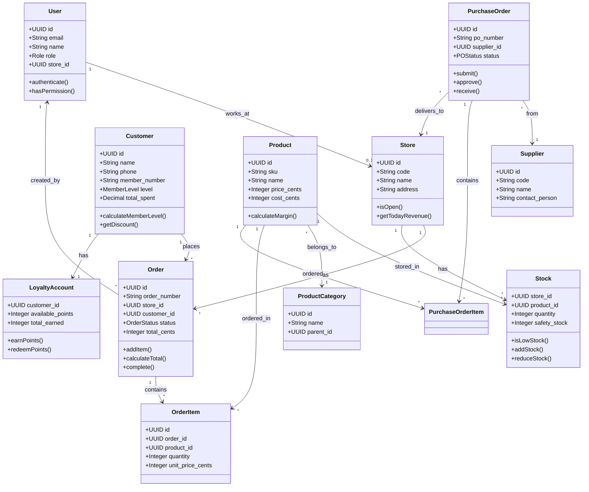

# 領域模型 (Domain Model)

## 1. 領域模型概述

領域模型描述了咖啡館連鎖管理系統中的核心業務概念、實體及其之間的關係。此模型是系統設計的基礎，反映了真實業務世界的抽象。

---

## 2. 核心領域實體

### 2.1 使用者與權限領域

#### User (使用者)
**描述**: 系統使用者，包含店員、店長、總部人員、管理員等
**屬性**:
- `id`: UUID - 唯一識別碼
- `email`: String - 登入帳號/Email
- `password_hash`: String - 加密密碼
- `name`: String - 使用者姓名
- `role`: Role - 角色
- `store_id`: UUID - 所屬門店（可空，總部人員無門店）
- `status`: Enum - 狀態 (Active, Inactive, Locked)
- `created_at`: DateTime - 建立時間
- `last_login_at`: DateTime - 最後登入時間

**行為**:
- `authenticate()` - 驗證密碼
- `changePassword()` - 變更密碼
- `hasPermission(permission)` - 檢查權限

#### Role (角色)
**描述**: 使用者角色定義
**屬性**:
- `id`: UUID
- `name`: String - 角色名稱 (Admin, Manager, StoreManager, Staff)
- `permissions`: Permission[] - 權限列表

**行為**:
- `addPermission()` - 新增權限
- `removePermission()` - 移除權限

### 2.2 門店領域

#### Store (門店)
**描述**: 連鎖咖啡館的單一門店
**屬性**:
- `id`: UUID
- `code`: String - 門店代碼 (唯一)
- `name`: String - 門店名稱
- `address`: String - 地址
- `phone`: String - 電話
- `opening_hours`: String - 營業時間
- `tax_rate`: Decimal - 稅率
- `status`: Enum - 狀態 (Active, Inactive)
- `created_at`: DateTime

**關聯**:
- 擁有多個 `Staff` (員工)
- 擁有多個 `Order` (訂單)
- 擁有多個 `Stock` (庫存)

**行為**:
- `isOpen(time)` - 檢查是否營業中
- `getTodayRevenue()` - 取得今日營收

### 2.3 客戶領域

#### Customer (客戶/會員)
**描述**: 咖啡館的客戶，可能是會員
**屬性**:
- `id`: UUID
- `owner_user_id`: UUID - 建立此客戶資料的使用者
- `name`: String - 姓名
- `phone`: String - 手機號碼 (唯一識別碼)
- `email`: String - Email (可空)
- `birthday`: Date - 生日 (可空)
- `member_number`: String - 會員編號
- `member_level`: Enum - 會員等級 (Regular, Silver, Gold, Platinum)
- `total_spent`: Decimal - 累計消費金額
- `total_visits`: Integer - 累計消費次數
- `created_at`: DateTime
- `last_visit_at`: DateTime - 最後消費日期

**關聯**:
- 擁有多個 `Order` (訂單)
- 擁有一個 `LoyaltyAccount` (點數帳戶)
- 擁有多個 `CustomerTag` (標籤)

**行為**:
- `calculateMemberLevel()` - 計算會員等級
- `getDiscount()` - 取得會員折扣
- `recordVisit()` - 記錄消費

#### LoyaltyAccount (點數帳戶)
**描述**: 會員的點數累積與兌換記錄
**屬性**:
- `customer_id`: UUID - 所屬客戶
- `available_points`: Integer - 可用點數
- `total_earned`: Integer - 累計獲得點數
- `total_redeemed`: Integer - 累計兌換點數
- `updated_at`: DateTime

**關聯**:
- 屬於一個 `Customer`
- 擁有多個 `PointTransaction` (點數異動記錄)

**行為**:
- `earnPoints(amount)` - 累積點數
- `redeemPoints(amount)` - 兌換點數
- `canRedeem(amount)` - 檢查是否可兌換

#### PointTransaction (點數交易記錄)
**描述**: 點數的累積或兌換記錄
**屬性**:
- `id`: UUID
- `customer_id`: UUID
- `type`: Enum - 類型 (Earn, Redeem, Expire, Adjust)
- `amount`: Integer - 點數數量 (正數=累積，負數=兌換)
- `order_id`: UUID - 關聯訂單 (可空)
- `description`: String - 說明
- `created_at`: DateTime

### 2.4 商品與庫存領域

#### Product (商品)
**描述**: 可販售的商品主檔
**屬性**:
- `id`: UUID
- `sku`: String - 商品編碼 (唯一)
- `name`: String - 商品名稱
- `category`: ProductCategory - 商品分類
- `description`: String - 商品描述
- `price_cents`: Integer - 售價 (分)
- `cost_cents`: Integer - 成本 (分)
- `image_url`: String - 商品圖片
- `status`: Enum - 狀態 (Active, Inactive)
- `created_at`: DateTime

**關聯**:
- 屬於一個 `ProductCategory` (分類)
- 擁有多個 `ProductVariant` (規格)
- 擁有多個 `Stock` (各門店庫存)

**行為**:
- `calculateMargin()` - 計算毛利率
- `isAvailable()` - 檢查是否可販售

#### ProductCategory (商品分類)
**描述**: 商品的層級分類
**屬性**:
- `id`: UUID
- `name`: String - 分類名稱
- `parent_id`: UUID - 父分類 (可空)
- `sort_order`: Integer - 排序
- `icon`: String - 圖示

**關聯**:
- 擁有多個子 `ProductCategory`
- 擁有多個 `Product`

#### ProductVariant (商品規格)
**描述**: 商品的可選規格 (尺寸、溫度、甜度等)
**屬性**:
- `id`: UUID
- `product_id`: UUID
- `type`: String - 規格類型 (Size, Temperature, Sweetness)
- `name`: String - 規格名稱 (大杯、熱、正常糖)
- `price_adjustment`: Integer - 價格調整 (分)
- `sort_order`: Integer

#### Stock (庫存)
**描述**: 特定門店的商品庫存數量
**屬性**:
- `store_id`: UUID
- `product_id`: UUID
- `quantity`: Integer - 庫存數量
- `safety_stock`: Integer - 安全庫存
- `max_stock`: Integer - 最大庫存
- `updated_at`: DateTime

**關聯**:
- 屬於一個 `Store`
- 屬於一個 `Product`
- 擁有多個 `StockMovement` (庫存異動)

**行為**:
- `isLowStock()` - 檢查是否低於安全庫存
- `addStock(quantity)` - 增加庫存
- `reduceStock(quantity)` - 扣減庫存

#### StockMovement (庫存異動)
**描述**: 庫存數量的異動記錄
**屬性**:
- `id`: UUID
- `store_id`: UUID
- `product_id`: UUID
- `delta`: Integer - 異動數量 (正數=入庫，負數=出庫)
- `reason`: Enum - 原因 (Purchase, Sale, Transfer, Adjustment, Loss)
- `reference_id`: UUID - 關聯單據 (訂單/採購單)
- `created_at`: DateTime
- `created_by`: UUID - 操作人

### 2.5 訂單領域

#### Order (訂單)
**描述**: 客戶的購買訂單
**屬性**:
- `id`: UUID
- `order_number`: String - 訂單編號
- `store_id`: UUID - 門店
- `user_id`: UUID - 操作店員
- `customer_id`: UUID - 客戶 (可空，非會員訂單)
- `status`: Enum - 狀態 (Draft, Completed, Cancelled)
- `subtotal_cents`: Integer - 小計
- `tax_cents`: Integer - 稅額
- `discount_cents`: Integer - 折扣
- `total_cents`: Integer - 總金額
- `payment_method`: Enum - 付款方式 (Cash, CreditCard, MobilePay)
- `points_earned`: Integer - 本單累積點數
- `points_redeemed`: Integer - 本單兌換點數
- `created_at`: DateTime
- `completed_at`: DateTime

**關聯**:
- 屬於一個 `Store`
- 屬於一個 `Customer` (可空)
- 由一個 `User` (店員) 建立
- 擁有多個 `OrderItem` (訂單項目)
- 擁有一個 `Payment` (付款記錄)
- 可能擁有一個 `Invoice` (發票)

**行為**:
- `addItem(product, quantity)` - 新增商品
- `removeItem(itemId)` - 移除商品
- `calculateTotal()` - 計算總金額
- `applyDiscount(customer)` - 套用折扣
- `complete()` - 完成訂單
- `cancel()` - 取消訂單

#### OrderItem (訂單項目)
**描述**: 訂單中的單一商品項目
**屬性**:
- `id`: UUID
- `order_id`: UUID
- `product_id`: UUID
- `product_name`: String - 商品名稱快照
- `quantity`: Integer - 數量
- `unit_price_cents`: Integer - 單價
- `subtotal_cents`: Integer - 小計
- `variants`: String - 選擇的規格 (JSON)

**關聯**:
- 屬於一個 `Order`
- 參照一個 `Product`

#### Payment (付款)
**描述**: 訂單的付款記錄
**屬性**:
- `id`: UUID
- `order_id`: UUID
- `method`: Enum - 付款方式
- `amount_cents`: Integer - 付款金額
- `received_cents`: Integer - 收款金額 (現金付款用)
- `change_cents`: Integer - 找零金額
- `transaction_id`: String - 交易編號 (第三方支付)
- `status`: Enum - 狀態 (Pending, Success, Failed)
- `paid_at`: DateTime

#### Invoice (發票)
**描述**: 訂單的發票記錄
**屬性**:
- `id`: UUID
- `order_id`: UUID
- `invoice_number`: String - 發票號碼
- `tax_id`: String - 統一編號 (可空)
- `issued_at`: DateTime - 開立時間
- `printed`: Boolean - 是否已列印

### 2.6 採購領域

#### Supplier (供應商)
**描述**: 商品的供應商
**屬性**:
- `id`: UUID
- `code`: String - 供應商代碼
- `name`: String - 供應商名稱
- `contact_person`: String - 聯絡人
- `phone`: String - 電話
- `email`: String - Email
- `address`: String - 地址
- `payment_terms`: String - 付款條件
- `rating`: Integer - 評級 (1-5)
- `status`: Enum - 狀態 (Active, Inactive)

**關聯**:
- 擁有多個 `PurchaseOrder` (採購單)

#### PurchaseOrder (採購單)
**描述**: 向供應商採購商品的訂單
**屬性**:
- `id`: UUID
- `po_number`: String - 採購單號
- `supplier_id`: UUID - 供應商
- `store_id`: UUID - 目標門店
- `status`: Enum - 狀態 (Draft, Submitted, Approved, Rejected, Receiving, Completed, Cancelled)
- `total_cents`: Integer - 總金額
- `expected_delivery_date`: Date - 預計交貨日
- `created_by`: UUID - 建立人
- `approved_by`: UUID - 審核人 (可空)
- `approved_at`: DateTime - 審核時間 (可空)
- `notes`: String - 備註
- `created_at`: DateTime

**關聯**:
- 屬於一個 `Supplier`
- 屬於一個 `Store`
- 擁有多個 `PurchaseOrderItem` (採購項目)

**行為**:
- `submit()` - 提交審核
- `approve()` - 審核通過
- `reject(reason)` - 審核拒絕
- `receive()` - 進貨入庫
- `cancel()` - 取消採購單

#### PurchaseOrderItem (採購項目)
**描述**: 採購單中的單一商品項目
**屬性**:
- `id`: UUID
- `po_id`: UUID
- `product_id`: UUID
- `quantity`: Integer - 採購數量
- `received_quantity`: Integer - 已入庫數量
- `unit_cost_cents`: Integer - 單位成本
- `subtotal_cents`: Integer - 小計

**關聯**:
- 屬於一個 `PurchaseOrder`
- 參照一個 `Product`

---

## 3. 領域模型關係圖



---

## 4. 聚合根 (Aggregate Roots)

在領域驅動設計中，聚合根是保證業務一致性的邊界。以下是系統的主要聚合根：

### 4.1 Order 聚合
- **聚合根**: Order
- **實體**: OrderItem, Payment, Invoice
- **一致性規則**:
  - 訂單總金額 = 所有訂單項目小計之和
  - 訂單完成後不可修改
  - 付款金額必須等於訂單總金額

### 4.2 Customer 聚合
- **聚合根**: Customer
- **實體**: LoyaltyAccount, PointTransaction
- **一致性規則**:
  - 點數餘額 = 累計獲得 - 累計兌換
  - 會員等級根據累計消費自動計算
  - 點數不可為負數

### 4.3 PurchaseOrder 聚合
- **聚合根**: PurchaseOrder
- **實體**: PurchaseOrderItem
- **一致性規則**:
  - 採購單總金額 = 所有項目小計之和
  - 審核通過後才可入庫
  - 已入庫數量不可超過採購數量

### 4.4 Product 聚合
- **聚合根**: Product
- **值物件**: ProductVariant
- **一致性規則**:
  - SKU 必須唯一
  - 價格必須大於 0
  - 商品上架時必須有分類

### 4.5 Stock 聚合
- **聚合根**: Stock
- **實體**: StockMovement
- **一致性規則**:
  - 庫存數量 = 初始庫存 + 所有異動總和
  - 庫存不可為負數
  - 所有庫存異動必須可追溯

---

## 5. 領域事件 (Domain Events)

領域事件用於解耦不同聚合之間的互動：

### 5.1 訂單相關事件
- `OrderCreated` - 訂單建立
- `OrderCompleted` - 訂單完成
- `OrderCancelled` - 訂單取消

### 5.2 庫存相關事件
- `StockReduced` - 庫存扣減
- `StockAdded` - 庫存增加
- `LowStockDetected` - 低庫存警告

### 5.3 會員相關事件
- `CustomerRegistered` - 客戶註冊
- `PointsEarned` - 點數累積
- `PointsRedeemed` - 點數兌換
- `MemberLevelUpgraded` - 會員升級

### 5.4 採購相關事件
- `PurchaseOrderSubmitted` - 採購單提交
- `PurchaseOrderApproved` - 採購單審核通過
- `PurchaseOrderReceived` - 採購單入庫

---

## 6. 值物件 (Value Objects)

值物件是不可變的、無身份的領域概念：

### 6.1 Money (金額)
```go
type Money struct {
    Cents    int
    Currency string
}
```

### 6.2 PhoneNumber (電話號碼)
```go
type PhoneNumber struct {
    CountryCode string
    Number      string
}
```

### 6.3 Address (地址)
```go
type Address struct {
    City     string
    District string
    Street   string
    ZipCode  string
}
```

### 6.4 DateRange (日期範圍)
```go
type DateRange struct {
    StartDate time.Time
    EndDate   time.Time
}
```

---

## 7. 領域服務 (Domain Services)

當業務邏輯不適合放在任何單一實體時，使用領域服務：

### 7.1 PricingService (定價服務)
- 計算會員折扣
- 計算促銷優惠
- 計算點數折抵

### 7.2 InventoryService (庫存服務)
- 檢查庫存可用性
- 預留庫存
- 釋放庫存

### 7.3 LoyaltyService (忠誠度服務)
- 計算點數累積
- 計算會員等級
- 驗證點數兌換

### 7.4 ReportingService (報表服務)
- 計算營收統計
- 計算商品銷售排行
- 計算客戶分析指標

---

## 8. 限界上下文 (Bounded Contexts)

系統劃分為以下限界上下文，每個對應一個微服務：

| 上下文 | 微服務 | 核心聚合 |
|--------|--------|----------|
| 身份與存取 | Auth Service | User, Role |
| 客戶管理 | Customers Service | Customer, LoyaltyAccount |
| 訂單管理 | Orders Service | Order |
| 商品與庫存 | Inventory Service | Product, Stock |
| 採購管理 | (Inventory Service 的一部分) | PurchaseOrder, Supplier |
| 會員忠誠度 | Loyalty Service | LoyaltyAccount, PointTransaction |
| 報表分析 | Reports Service | (唯讀投影) |
| 通知 | Notifications Service | (支援服務) |

---

**下一步：撰寫業務流程文件**
