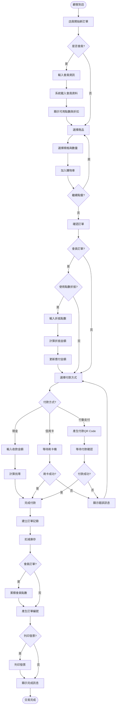
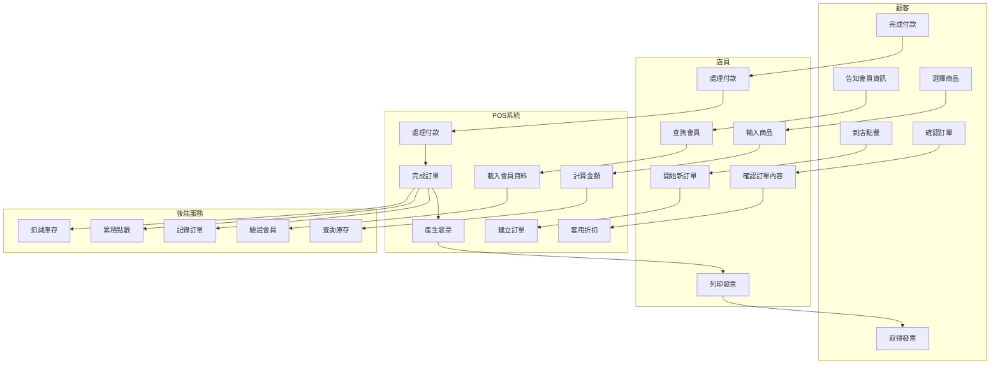
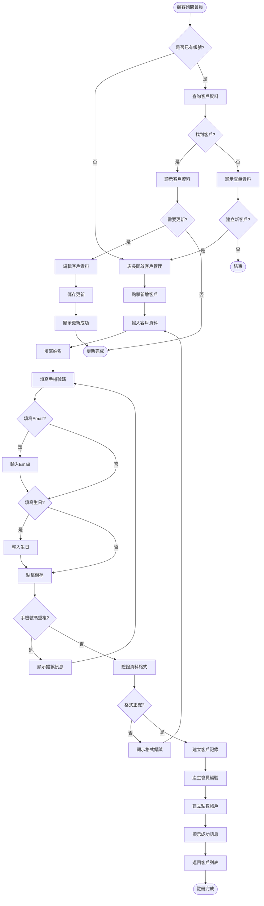
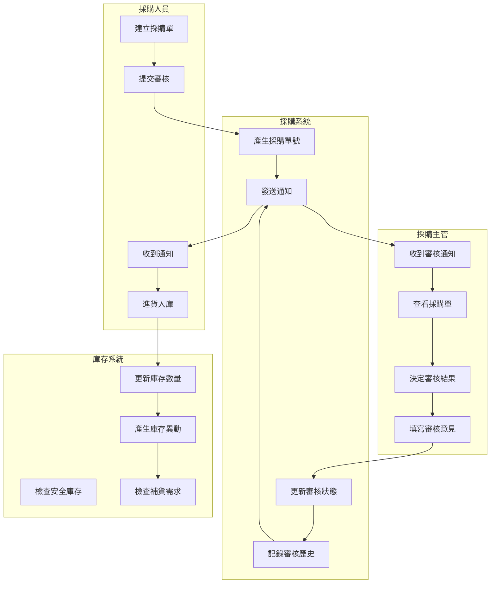
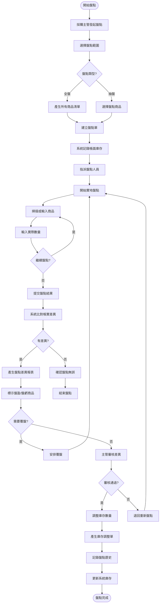
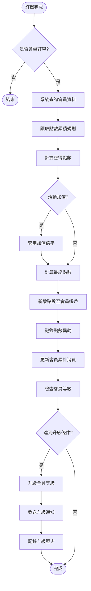
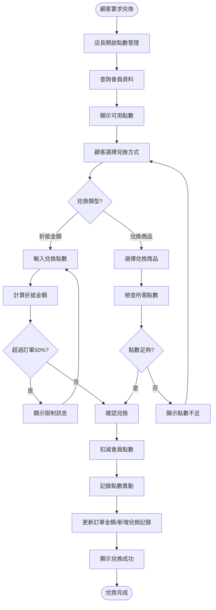
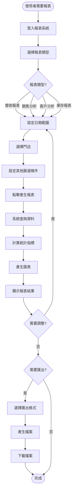

# 業務流程 (Business Processes)

## 1. 業務流程概述

本文件描述咖啡館連鎖管理系統的關鍵業務流程,包括活動圖、泳道圖和詳細的流程說明。

---

## 2. POS 點餐與結帳流程

### 2.1 流程圖

### 2.2 泳道圖

### 2.3 流程說明

**流程名稱**: POS 點餐與結帳  
**流程 ID**: BP-001  
**觸發條件**: 顧客到店消費  
**參與角色**: 顧客、店員、POS 系統、後端服務  
**預期結果**: 完成訂單並記錄交易  
**平均耗時**: 2-3 分鐘  

**詳細步驟**:
1. 店員在 POS 系統開始新訂單
2. 如為會員,輸入會員識別資訊(手機/條碼)
3. 系統查詢並顯示會員資料與可用點數
4. 店員根據顧客需求選擇商品、規格、數量
5. 系統即時計算訂單金額
6. 確認訂單後,詢問付款方式
7. 根據付款方式處理交易
8. 系統建立訂單記錄並扣減庫存
9. 會員訂單自動累積點數
10. 選擇性列印發票
11. 顯示訂單編號供顧客取餐

**異常處理**:
- 會員不存在: 引導建立新會員
- 商品庫存不足: 提示並建議替代商品
- 付款失敗: 重試或更換付款方式
- 網路中斷: 啟用離線模式,待網路恢復後同步

---

## 3. 客戶註冊與管理流程

### 3.1 流程圖

### 3.2 流程說明

**流程名稱**: 客戶註冊與管理  
**流程 ID**: BP-002  
**觸發條件**: 顧客詢問會員或需要更新資料  
**參與角色**: 顧客、店長/店員、客戶服務  
**預期結果**: 客戶資料建立或更新成功  
**平均耗時**: 1-2 分鐘  

**關鍵控制點**:
- 手機號碼唯一性檢查
- 資料格式驗證(手機、Email)
- 個資保護措施(加密儲存)

---

## 4. 採購與入庫流程

### 4.1 完整流程圖

```mermaid
flowchart TD
    Start([採購需求產生]) --> A1{需求來源?}
    
    A1 -->|庫存預警| A2[系統產生低庫存清單]
    A2 --> A3[採購人員查看清單]
    
    A1 -->|定期採購| A3
    A1 -->|臨時需求| A3
    
    A3 --> A4[建立採購單]
    A4 --> A5[選擇目標門店]
    A5 --> A6[選擇供應商]
    A6 --> A7[新增採購商品]
    A7 --> A8[輸入採購數量]
    A8 --> A9[系統計算金額]
    A9 --> A10{繼續新增商品?}
    
    A10 -->|是| A7
    A10 -->|否| A11[填寫預計交貨日期]
    
    A11 --> A12[填寫備註]
    A12 --> A13{儲存方式?}
    
    A13 -->|草稿| A14[儲存為草稿]
    A14 --> End1([稍後繼續編輯])
    
    A13 -->|提交| A15[提交審核]
    A15 --> A16[系統產生採購單號]
    A16 --> A17[發送審核通知]
    A17 --> A18[採購主管收到通知]
    
    A18 --> A19[查看採購單]
    A19 --> A20[檢查採購內容]
    A20 --> A21{審核結果?}
    
    A21 -->|通過| A22[點擊審核通過]
    A22 --> A23[更新狀態為已審核]
    A23 --> A24[通知採購人員]
    A24 --> A25[等待供應商交貨]
    
    A21 -->|拒絕| A26[填寫拒絕原因]
    A26 --> A27[更新狀態為已拒絕]
    A27 --> A28[通知採購人員]
    A28 --> A29{修改後重提?}
    A29 -->|是| A4
    A29 -->|否| End2([採購單結束])
    
    A25 --> A30[供應商交貨]
    A30 --> A31[採購人員驗收]
    A31 --> A32{數量正確?}
    
    A32 -->|否| A33[記錄差異]
    A33 --> A34[聯絡供應商]
    A34 --> A35[部分入庫]
    
    A32 -->|是| A36[確認入庫]
    A35 --> A36
    
    A36 --> A37[系統更新庫存]
    A37 --> A38[產生庫存異動記錄]
    A38 --> A39[更新採購單狀態為已完成]
    A39 --> A40[通知相關人員]
    A40 --> A41{觸發補貨?}
    
    A41 -->|是| A42[自動產生補貨建議]
    A42 --> End3([入庫完成])
    
    A41 -->|否| End3
```

### 4.2 泳道圖 - 採購審核流程

### 4.3 流程說明

**流程名稱**: 採購與入庫  
**流程 ID**: BP-003  
**觸發條件**: 庫存低於安全庫存、定期採購、臨時需求  
**參與角色**: 採購人員、採購主管、供應商、庫存系統  
**預期結果**: 商品採購並成功入庫,庫存更新  
**平均耗時**: 3-7 個工作天  

**關鍵里程碑**:
1. 採購單建立 (Day 0)
2. 審核完成 (Day 0-1)
3. 供應商交貨 (Day 2-5)
4. 入庫完成 (Day 3-7)

**業務規則**:
- 採購金額 > $10,000 需主管審核
- 採購單提交後不可修改,僅可取消
- 入庫數量與採購數量差異 > 5% 需記錄並處理
- 入庫後自動觸發庫存預警檢查

---

## 5. 庫存盤點流程

### 5.1 流程圖

### 5.2 流程說明

**流程名稱**: 庫存盤點  
**流程 ID**: BP-004  
**觸發條件**: 月底例行盤點、異常盤點、年度盤點  
**參與角色**: 採購主管、盤點人員、系統  
**預期結果**: 庫存數量正確反映實際狀況  
**平均耗時**: 全盤 2-4 小時、抽盤 30-60 分鐘  

**關鍵控制點**:
- 盤點期間凍結庫存異動
- 差異超過 3% 需覆盤
- 所有調整需主管審核
- 完整記錄盤點歷史

---

## 6. 會員點數管理流程

### 6.1 點數累積流程

### 6.2 點數兌換流程

### 6.3 流程說明

**流程名稱**: 會員點數管理  
**流程 ID**: BP-005  
**觸發條件**: 訂單完成(累積)、顧客要求(兌換)  
**參與角色**: 系統自動(累積)、店長/店員(兌換)  
**預期結果**: 點數正確累積或兌換  

**業務規則**:
- 消費 $1 = 1 點
- 100 點 = $1 折抵
- 點數折抵上限為訂單金額 50%
- 點數有效期 1 年
- 會員等級:
  - 一般會員: 累計消費 $0
  - 銀卡會員: 累計消費 $5,000 (95折)
  - 金卡會員: 累計消費 $20,000 (9折)
  - 白金會員: 累計消費 $50,000 (85折)

---

## 7. 報表產生流程

### 7.1 流程圖

### 7.2 流程說明

**流程名稱**: 報表產生  
**流程 ID**: BP-006  
**觸發條件**: 使用者需要查看經營數據  
**參與角色**: 總部管理層、店長、報表服務  
**預期結果**: 產生所需報表並可匯出  
**平均耗時**: < 5 秒  

**可用報表類型**:
1. 營收報表: 日/週/月/年營收統計
2. 商品銷售分析: 熱銷商品、滯銷商品
3. 客戶分析: 新增、活躍、流失客戶統計
4. 庫存報表: 庫存狀況、低庫存預警
5. 毛利分析: 商品毛利率、門店毛利率

---

## 8. 業務流程關鍵指標 (KPI)

| 流程 | 關鍵指標 | 目標值 | 監控頻率 |
|------|---------|--------|---------|
| POS點餐結帳 | 平均交易時間 | < 3分鐘 | 即時 |
| POS點餐結帳 | 訂單取消率 | < 2% | 每日 |
| 客戶註冊 | 會員轉換率 | > 30% | 每週 |
| 採購入庫 | 採購單準時交貨率 | > 95% | 每月 |
| 採購入庫 | 入庫差異率 | < 3% | 每月 |
| 庫存盤點 | 盤點準確率 | > 98% | 每月 |
| 點數管理 | 點數兌換率 | > 20% | 每月 |
| 報表產生 | 報表產生時間 | < 5秒 | 即時 |

---

## 9. 流程優化建議

### 9.1 短期優化 (1-3個月)
1. **POS流程優化**
   - 常用商品快捷鍵
   - 語音點餐輔助
   - 預設規格設定

2. **採購流程優化**
   - 自動補貨建議
   - 供應商評級機制
   - 批次審核功能

### 9.2 中期優化 (3-6個月)
1. **智能推薦**
   - 基於歷史的商品推薦
   - 個人化會員優惠
   - 最佳採購時機預測

2. **流程自動化**
   - 自動對帳功能
   - 智能排班系統
   - 異常自動警報

### 9.3 長期優化 (6-12個月)
1. **數據驅動決策**
   - 需求預測模型
   - 動態定價策略
   - 客戶流失預警

2. **多渠道整合**
   - 線上訂單整合
   - 外送平台對接
   - 會員 App 開發

---

**下一步：撰寫系統範圍與限制文件**
