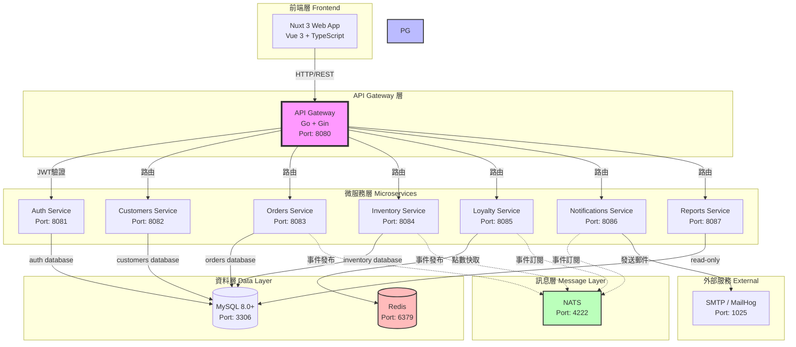
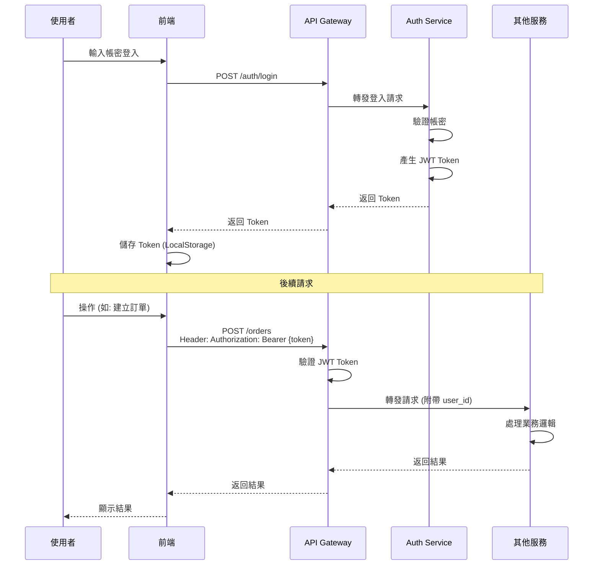

# 架構設計文件

## 1. 系統整體架構

### 1.1 微服務架構圖



---

## 2. 微服務職責劃分

### 2.1 API Gateway
**職責**:
- 統一入口與路由
- JWT Token 驗證
- 請求轉發到對應微服務
- 跨域(CORS)處理
- Rate Limiting

**技術棧**: Go + Gin  
**Port**: 8080  
**不包含**: 業務邏輯、資料儲存

---

### 2.2 Auth Service (認證服務)
**職責**:
- 使用者註冊
- 使用者登入 (產生 JWT Token)
- 密碼變更
- Token 驗證

**資料庫**: MySQL (`coffee_auth` database)  
**Port**: 8081  
**核心 Entity**: User, Role

---

### 2.3 Customers Service (客戶服務)
**職責**:
- 客戶資料管理 (CRUD)
- 客戶查詢與搜尋
- 客戶標籤管理
- 消費歷史查詢

**資料庫**: MySQL (`coffee_customers` database)  
**Port**: 8082  
**核心 Entity**: Customer, CustomerTag

---

### 2.4 Orders Service (訂單服務)
**職責**:
- 訂單建立
- 訂單查詢
- 訂單完成/取消
- 訂單項目管理
- 付款記錄

**資料庫**: MySQL (`coffee_orders` database)  
**Port**: 8083  
**核心 Entity**: Order, OrderItem, Payment, Invoice  
**事件發布**: `OrderCompleted`, `OrderCancelled`

---

### 2.5 Inventory Service (庫存服務)
**職責**:
- 商品管理 (CRUD)
- 商品分類管理
- 庫存管理 (查詢、更新)
- 庫存盤點
- 庫存調撥
- 採購單管理
- 供應商管理
- 進貨入庫

**資料庫**: MySQL (`coffee_inventory` database)  
**Port**: 8084  
**核心 Entity**: Product, ProductCategory, Stock, StockMovement, PurchaseOrder, Supplier  
**事件發布**: `StockReduced`, `LowStockDetected`

---

### 2.6 Loyalty Service (忠誠度服務)
**職責**:
- 會員點數管理
- 點數累積
- 點數兌換
- 點數異動記錄
- 會員等級計算

**快取**: Redis (點數即時讀寫)  
**資料庫**: MySQL (點數異動記錄持久化 - 存於 `coffee_customers` database)  
**Port**: 8085  
**核心 Entity**: LoyaltyAccount, PointTransaction  
**事件訂閱**: `OrderCompleted`

---

### 2.7 Notifications Service (通知服務)
**職責**:
- Email 通知發送
- 站內通知
- 通知範本管理
- 通知記錄

**資料庫**: MySQL (`coffee_notifications` database)  
**外部服務**: SMTP (MailHog for Dev)  
**Port**: 8086  
**核心 Entity**: Notification, NotificationTemplate  
**事件訂閱**: `OrderCompleted`, `LowStockDetected`, `PurchaseOrderApproved`

---

### 2.8 Reports Service (報表服務)
**職責**:
- 營收報表
- 商品銷售分析
- 客戶分析
- 庫存報表
- 報表匯出 (CSV, Excel, PDF)

**資料庫**: MySQL (Read-Only, 查詢所有 database)  
**Port**: 8087  
**特性**: 唯讀服務、複雜查詢、可能需要資料聚合

---

## 3. 服務間通訊設計

### 3.1 同步通訊 (HTTP/REST)
**使用場景**: 需要即時回應的操作
**通訊模式**: Request-Response

**範例**:
```
Frontend → Gateway → Orders Service → 建立訂單 → 返回結果
Gateway → Auth Service → 驗證Token → 返回使用者資訊
```

**優點**: 簡單直接、易於除錯  
**缺點**: 服務間耦合度較高

---

### 3.2 非同步通訊 (NATS 事件匯流排)
**使用場景**: 不需要即時回應、跨服務通知
**通訊模式**: Publish-Subscribe

**事件流範例**:
```
訂單完成流程:
1. Orders Service 完成訂單
2. Orders Service 發布 "OrderCompleted" 事件到 NATS
3. Loyalty Service 訂閱並接收事件 → 累積會員點數
4. Notifications Service 訂閱並接收事件 → 發送訂單確認郵件
5. Inventory Service 訂閱並接收事件 → 扣減庫存
```

**優點**: 低耦合、可擴展  
**缺點**: 除錯較複雜、需處理事件順序

---

### 3.3 事件定義

#### OrderCompleted 事件
```json
{
  "event_type": "OrderCompleted",
  "event_id": "uuid",
  "timestamp": "2025-11-16T10:30:00Z",
  "data": {
    "order_id": "uuid",
    "customer_id": "uuid",
    "store_id": "uuid",
    "total_cents": 35000,
    "items": [
      {
        "product_id": "uuid",
        "quantity": 2
      }
    ]
  }
}
```

#### LowStockDetected 事件
```json
{
  "event_type": "LowStockDetected",
  "event_id": "uuid",
  "timestamp": "2025-11-16T10:30:00Z",
  "data": {
    "store_id": "uuid",
    "product_id": "uuid",
    "current_quantity": 5,
    "safety_stock": 20
  }
}
```

---

## 4. 資料層設計

### 4.1 MySQL Database 劃分

```
MySQL 8.0+ Instance
│
├── coffee_auth (Auth Service)
│   ├── users
│   └── roles
│
├── coffee_customers (Customers Service + Loyalty Service)
│   ├── customers
│   ├── customer_tags
│   ├── loyalty_accounts
│   └── point_transactions
│
├── coffee_orders (Orders Service)
│   ├── orders
│   ├── order_items
│   ├── payments
│   └── invoices
│
├── coffee_inventory (Inventory Service)
│   ├── products
│   ├── product_categories
│   ├── product_variants
│   ├── stores
│   ├── stock
│   ├── stock_movements
│   ├── purchase_orders
│   ├── purchase_order_items
│   └── suppliers
│
└── coffee_notifications (Notifications Service)
    ├── notifications
    └── notification_templates
```

**設計原則**:
- 每個服務擁有獨立 Database
- 服務不可直接存取其他服務的資料表
- 跨服務資料查詢透過 API 或事件
- Reports Service 例外: 可唯讀存取所有 Database

---

### 4.2 Redis 使用設計

**使用場景**:
1. **會員點數快取** (Loyalty Service)
   - Key: `loyalty:customer:{customer_id}:points`
   - Value: Integer (可用點數)
   - TTL: 無 (持久化)

2. **Session 快取** (未來擴展)
   - Key: `session:{token}`
   - Value: JSON (使用者資訊)
   - TTL: 24 hours

3. **庫存快取** (未來優化)
   - Key: `stock:{store_id}:{product_id}`
   - Value: Integer (庫存數量)
   - TTL: 5 minutes

---

## 5. 認證與授權設計

### 5.1 JWT Token 流程



---

### 5.2 JWT Payload 結構

```json
{
  "sub": "user_id (uuid)",
  "email": "user@example.com",
  "role": "store_manager",
  "store_id": "store_uuid",
  "iat": 1700123456,
  "exp": 1700209856
}
```

---

### 5.3 權限控制

**角色 (Role)**:
- `admin` - 系統管理員
- `headquarters_manager` - 總部管理
- `store_manager` - 店長
- `staff` - 店員

**權限矩陣** (範例):

| API Endpoint | admin | headquarters | store_manager | staff |
|--------------|-------|--------------|---------------|-------|
| POST /auth/register | ✓ | ✗ | ✗ | ✗ |
| POST /orders | ✓ | ✓ | ✓ | ✓ |
| GET /customers | ✓ | ✓ | ✓ (本店) | ✓ (本店) |
| POST /customers | ✓ | ✓ | ✓ | ✗ |
| GET /reports/* | ✓ | ✓ | ✓ (本店) | ✗ |
| POST /inventory/products | ✓ | ✓ | ✗ | ✗ |
| POST /inventory/purchase-orders | ✓ | ✓ | ✗ | ✗ |

---

## 6. 錯誤處理設計

### 6.1 統一錯誤格式

```json
{
  "error": {
    "code": "INVALID_INPUT",
    "message": "商品數量必須大於0",
    "details": {
      "field": "quantity",
      "value": -1
    },
    "request_id": "req_abc123",
    "timestamp": "2025-11-16T10:30:00Z"
  }
}
```

---

### 6.2 錯誤碼定義

| 錯誤碼 | HTTP Status | 說明 |
|-------|-------------|------|
| `INVALID_INPUT` | 400 | 輸入資料格式錯誤 |
| `UNAUTHORIZED` | 401 | 未登入或 Token 無效 |
| `FORBIDDEN` | 403 | 無權限執行操作 |
| `NOT_FOUND` | 404 | 資源不存在 |
| `CONFLICT` | 409 | 資源衝突 (如: 重複建立) |
| `INTERNAL_ERROR` | 500 | 伺服器內部錯誤 |
| `SERVICE_UNAVAILABLE` | 503 | 服務暫時無法使用 |

---

## 7. 日誌與監控設計

### 7.1 結構化日誌格式 (JSON)

```json
{
  "timestamp": "2025-11-16T10:30:00Z",
  "level": "info",
  "service": "orders-service",
  "trace_id": "abc123",
  "user_id": "user_uuid",
  "method": "POST",
  "path": "/orders",
  "status": 201,
  "duration_ms": 150,
  "message": "Order created successfully"
}
```

---

### 7.2 關鍵監控指標

| 指標類別 | 指標 | 目標值 |
|---------|------|--------|
| **效能** | API 響應時間 (P95) | < 300ms |
| **效能** | 資料庫查詢時間 (P95) | < 100ms |
| **可用性** | 服務可用率 | > 99.5% |
| **業務** | 訂單成功率 | > 98% |
| **業務** | 每日活躍用戶 | - |

---

## 8. 擴展性設計

### 8.1 水平擴展
- 所有微服務設計為 **無狀態 (Stateless)**
- 可透過 Docker Compose scale 指令擴展實例數
- Gateway 需配合負載平衡器 (未來)

```bash
docker compose up --scale orders=3 --scale customers=2
```

---

### 8.2 資料庫擴展
**Phase 1-2**: 單一 MySQL 8.0+ 實例  
**Phase 3 (未來)**: 
- 讀寫分離 (Master-Slave Replication)
- 連線池優化 (Connection Pooling)
- 查詢快取 (Query Cache)
- 分庫分表 (Database Sharding)

---

## 9. 安全設計

### 9.1 網路安全
- ✅ HTTPS 加密 (TLS 1.2+)
- ✅ CORS 設定
- ✅ Rate Limiting (每IP每分鐘100次)
- ✅ SQL Injection 防護 (Prepared Statement)
- ✅ XSS 防護 (輸入驗證與輸出編碼)

### 9.2 資料安全
- ✅ 密碼 bcrypt 加密 (cost=10)
- ✅ JWT Token 簽章驗證
- ✅ 敏感資料加密儲存
- ✅ 資料庫連線加密
- ✅ 備份資料加密

---

## 10. 部署架構 (Docker Compose)

```yaml
# 簡化版 docker-compose 架構
services:
  gateway:       # API Gateway
  auth:          # Auth 微服務
  customers:     # Customers 微服務
  orders:        # Orders 微服務
  inventory:     # Inventory 微服務
  loyalty:       # Loyalty 微服務
  notifications: # Notifications 微服務
  reports:       # Reports 微服務
  webapp:        # Nuxt 前端
  mysql:         # MySQL 8.0+ 資料庫
  redis:         # Redis 快取
  nats:          # NATS 訊息佇列
  mailhog:       # 郵件測試工具
```

**網路拓撲**:
- 所有服務在同一 Docker 網路
- 僅 Gateway 和 WebApp 暴露對外 Port
- 內部服務間透過服務名稱通訊

---

**完成系統架構設計,下一步: 資料庫 ERD 詳細設計**
