# 用戶流程設計 (User Flow Design)

## 1. 流程設計概述

### 1.1 設計原則
- **簡化步驟**: 最小化用戶完成任務所需的步驟
- **清晰導航**: 用戶始終知道自己在哪裡，下一步該做什麼
- **錯誤處理**: 提供清晰的錯誤訊息和恢復路徑
- **一致性**: 相似的任務使用相似的流程模式

### 1.2 流程分類
- **CRM 核心流程**: 店員日常操作流程
- **ERP 管理流程**: 總部管理決策流程
- **會員服務流程**: 客戶體驗相關流程
- **系統維護流程**: 技術和管理維護流程

---

## 2. CRM 系統用戶流程

### 2.1 店員登入流程
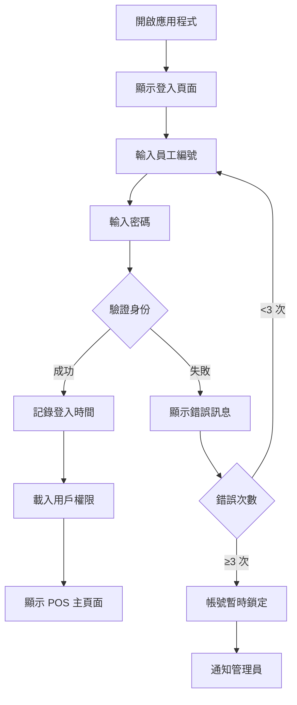

**關鍵決策點:**
- **身份驗證**: 3 次失敗後鎖定 30 分鐘
- **權限載入**: 根據角色載入對應功能模組
- **自動登出**: 超過 8 小時無操作自動登出

### 2.2 POS 點餐完整流程
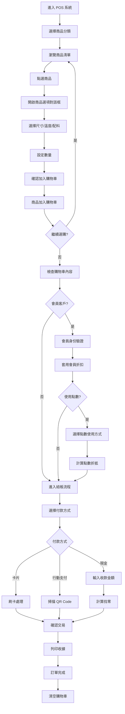

### 2.3 會員查詢與服務流程
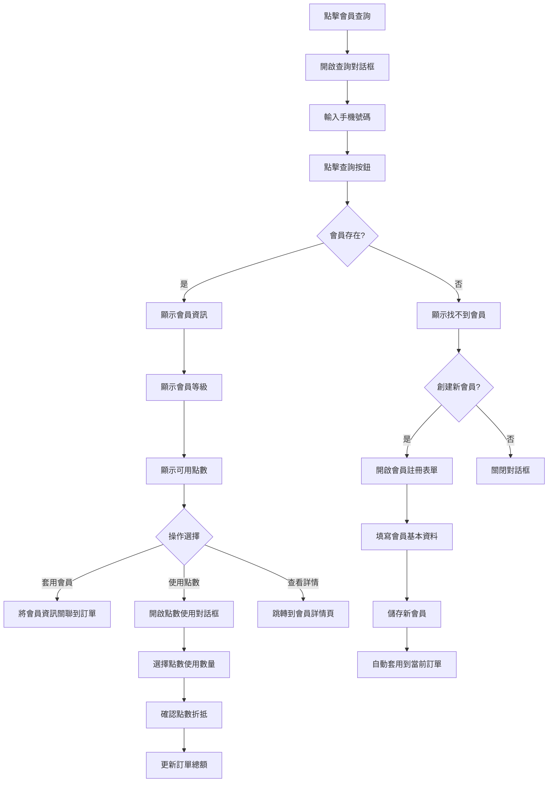

### 2.4 客戶管理流程
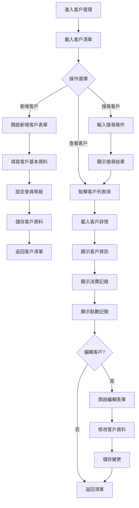

---

## 3. ERP 系統用戶流程

### 3.1 管理員登入與儀表板流程
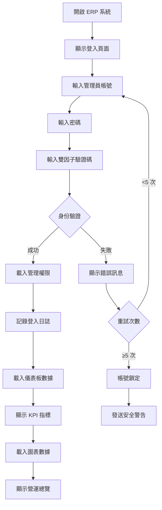

### 3.2 門店管理流程
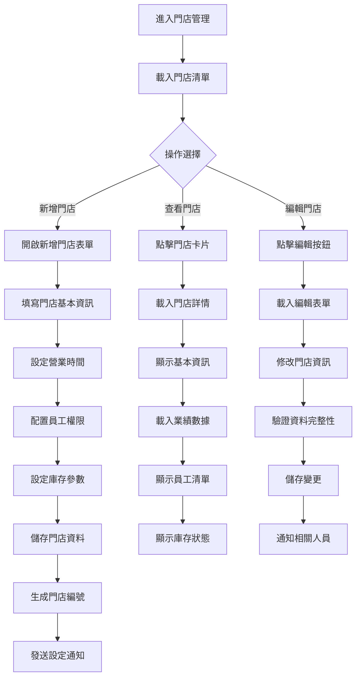

### 3.3 庫存管理流程
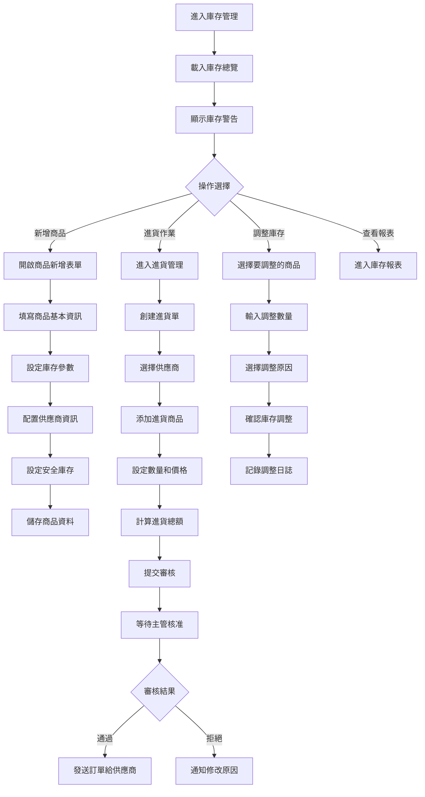

### 3.4 財務報表生成流程
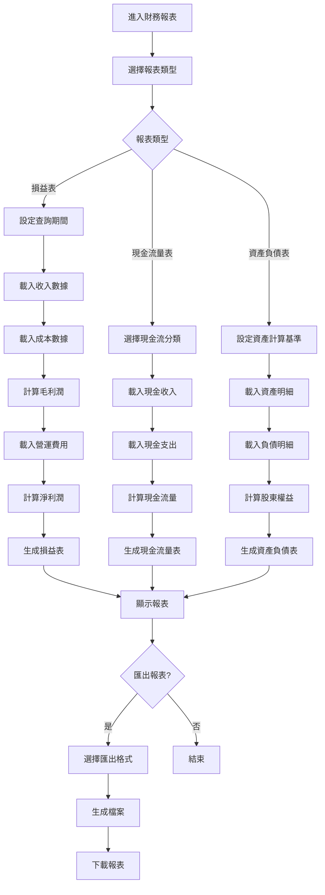

---

## 4. 會員服務流程

### 4.1 會員註冊流程
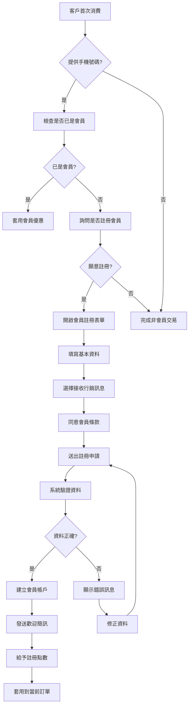

### 4.2 點數累積與使用流程
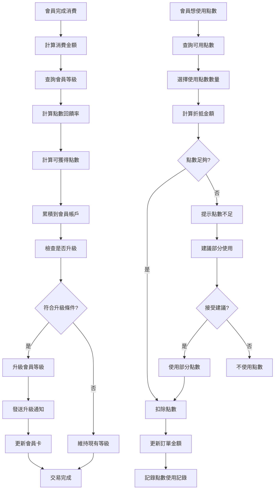

### 4.3 會員等級升級流程
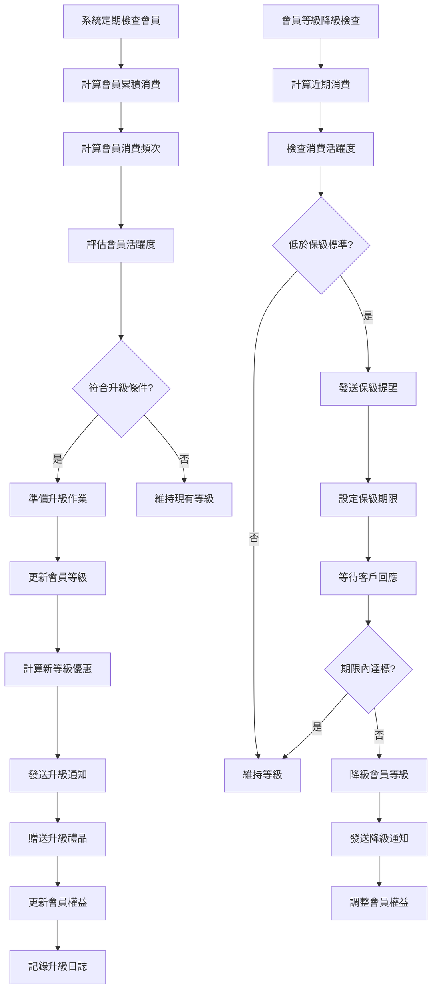

---

## 5. 系統維護流程

### 5.1 日常營運開店流程
```mermaid
graph TD
    A[店員到達門店] --> B[使用門店鑰匙開門]
    B --> C[開啟店內照明和設備]
    C --> D[登入 POS 系統]
    D --> E[執行開店檢查清單]
    E --> F[檢查設備運行狀態]
    F --> G[確認庫存狀況]
    G --> H[檢查昨日營收結算]
    H --> I[準備今日所需物料]
    I --> J[設定門店營業狀態為"營業中"]
    J --> K[系統自動通知總部開店]
    K --> L[開始接受訂單]
    
    M[準備打烊] --> N[停止接受新訂單]
    N --> O[完成最後訂單]
    O --> P[執行日終結算]
    P --> Q[統計今日營收]
    Q --> R[檢查庫存消耗]
    R --> S[清潔設備和環境]
    S --> T[關閉設備電源]
    T --> U[鎖定 POS 系統]
    U --> V[設定門店狀態為"休息中"]
    V --> W[上傳營業數據到總部]
    W --> X[鎖門離店]
```

### 5.2 庫存盤點流程
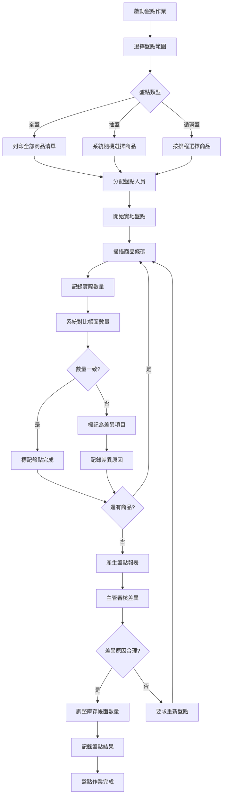

### 5.3 系統備份與維護流程
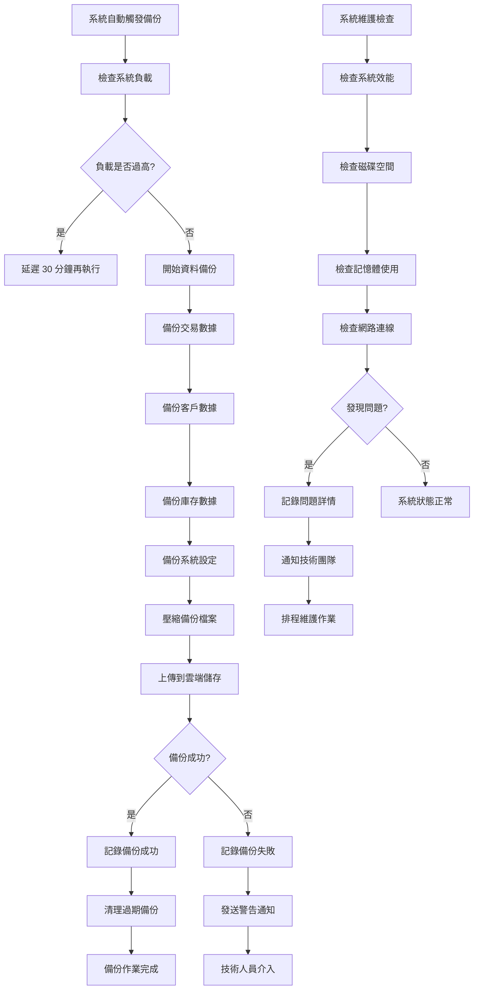

---

## 6. 錯誤處理流程

### 6.1 網路連線中斷處理
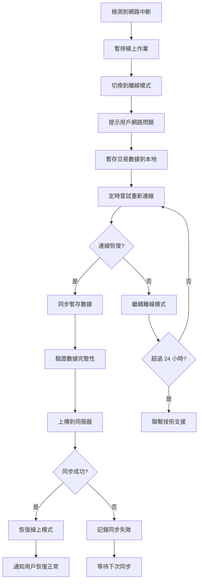

### 6.2 付款失敗處理流程
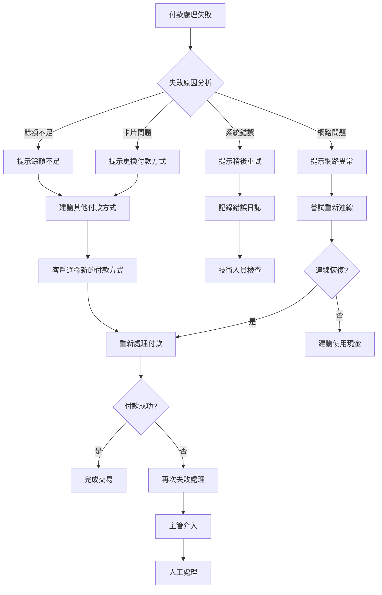

---

## 7. 流程優化建議

### 7.1 效率提升要點
1. **減少點擊次數**: 常用功能一鍵直達
2. **預填默認值**: 根據歷史行為智慧預填
3. **批量操作**: 支援多選批量處理
4. **快捷鍵**: 為熟練用戶提供鍵盤快捷鍵

### 7.2 用戶體驗優化
1. **進度提示**: 長時間操作顯示進度條
2. **操作確認**: 重要操作需要二次確認
3. **自動儲存**: 防止數據意外丟失
4. **智慧提示**: 根據上下文提供操作建議

### 7.3 錯誤預防
1. **資料驗證**: 即時驗證用戶輸入
2. **操作引導**: 新用戶提供操作指引
3. **狀態提示**: 清楚顯示當前系統狀態
4. **回復機制**: 提供操作撤銷功能

---

**版本**: v1.0  
**建立日期**: 2025-01-16  
**最後更新**: 2025-01-16  
**負責人**: UI/UX 設計團隊

**流程圖說明**:
- 所有流程圖使用 Mermaid 語法撰寫
- 決策點用菱形表示，操作用矩形表示
- 不同顏色代表不同的流程狀態
- 關鍵流程節點有詳細的業務邏輯說明