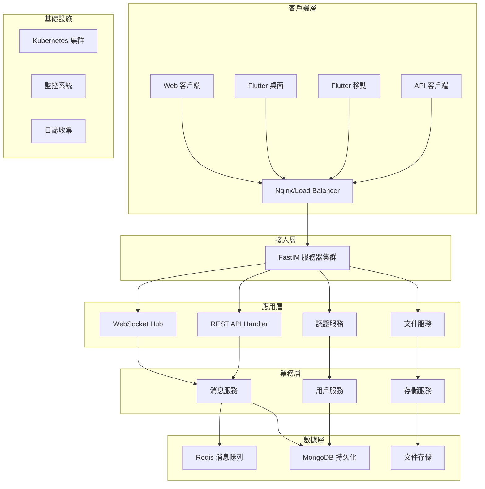
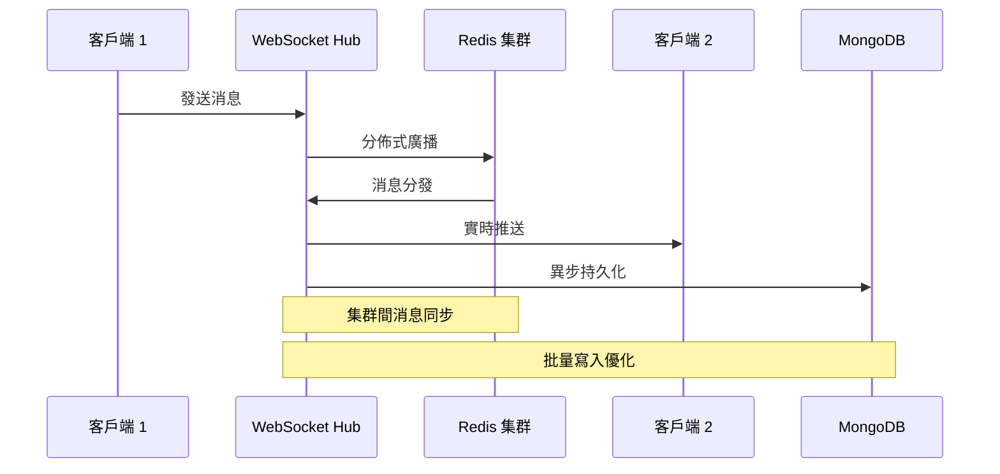
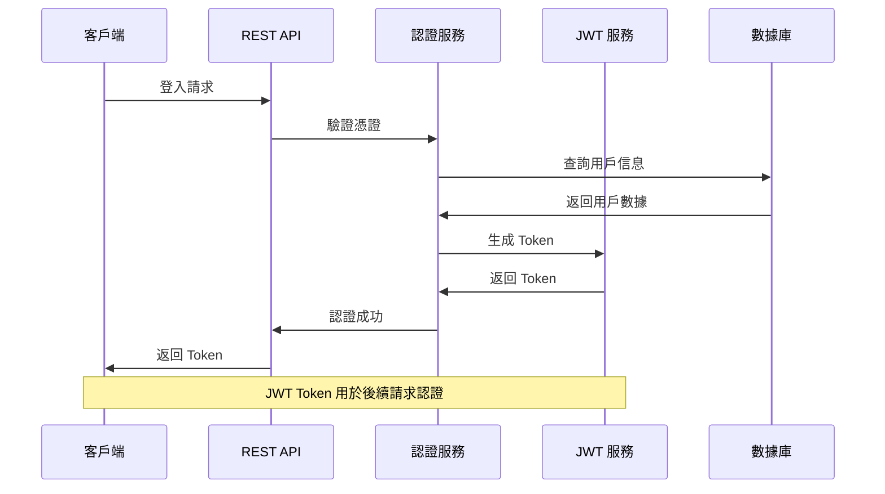
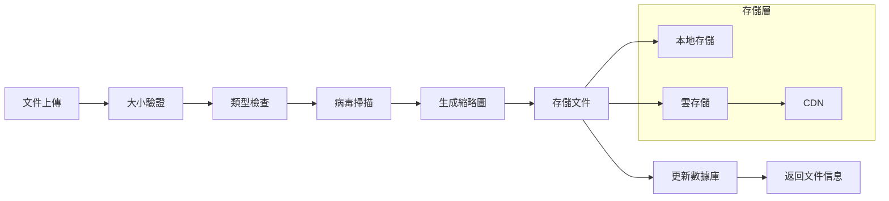

# FastIM 系統架構文檔

## 📋 目錄
1. [架構概覽](#架構概覽)
2. [系統設計原則](#系統設計原則)
3. [技術棧](#技術棧)
4. [核心組件](#核心組件)
5. [數據流架構](#數據流架構)
6. [分佈式設計](#分佈式設計)
7. [性能優化](#性能優化)
8. [擴展性設計](#擴展性設計)

---

## 🏗️ 架構概覽

### 整體架構圖



### 分層架構

| 層級 | 組件 | 職責 | 技術棧 |
|------|------|------|--------|
| **客戶端層** | Web/桌面/移動應用 | 用戶界面和交互 | Flutter, React, TypeScript |
| **接入層** | 負載均衡器 | 請求分發和 SSL 終止 | Nginx, HAProxy |
| **應用層** | FastIM 服務器 | 業務邏輯處理 | Go, Gin, Gorilla WebSocket |
| **業務層** | 各類服務 | 具體業務實現 | Go Services, Interfaces |
| **數據層** | 數據庫和存儲 | 數據持久化 | MongoDB, Redis, 文件系統 |
| **基礎設施** | 容器平台 | 運行環境管理 | Kubernetes, Docker |

---

## 🎯 系統設計原則

### 1. 高性能原則
- **低延遲優先**: WebSocket 通訊 <50ms 響應時間
- **高並發支持**: 支持 10,000+ 併發連接
- **資源高效**: ARM64 原生優化，記憶體使用最小化

### 2. 高可用原則
- **無單點故障**: 所有組件支持水平擴展
- **故障自動恢復**: 服務健康檢查和自動重啟
- **數據一致性**: 分佈式事務和數據同步

### 3. 可擴展原則
- **微服務架構**: 組件解耦，獨立部署
- **水平擴展**: 支持添加更多實例
- **彈性伸縮**: 根據負載自動調整資源

### 4. 安全原則
- **數據加密**: 傳輸和存儲加密
- **認證授權**: JWT 令牌和 RBAC 權限控制
- **輸入驗證**: 嚴格的輸入驗證和過濾

---

## 🛠️ 技術棧

### 後端技術棧

#### 編程語言和框架
```go
// 主要技術選型
Language: Go 1.21+
Framework: Gin Web Framework
WebSocket: Gorilla WebSocket
Concurrency: Goroutines + Channels
```

#### 關鍵依賴
```go
// go.mod 主要依賴
require (
    github.com/gin-gonic/gin v1.9.1
    github.com/gorilla/websocket v1.5.0
    github.com/redis/go-redis/v9 v9.2.1
    github.com/google/uuid v1.3.1
    go.mongodb.org/mongo-driver v1.12.1
    github.com/golang-jwt/jwt/v5 v5.0.0
    github.com/prometheus/client_golang v1.16.0
)
```

### 前端技術棧

#### Flutter 跨平台客戶端
```yaml
# pubspec.yaml 主要依賴
dependencies:
  flutter:
    sdk: flutter
  web_socket_channel: ^2.4.0
  provider: ^6.0.5
  http: ^1.1.0
  shared_preferences: ^2.2.2
  file_picker: ^5.5.0
```

#### Web 客戶端
```json
// package.json 主要依賴
{
  "dependencies": {
    "react": "^18.2.0",
    "typescript": "^5.2.0",
    "socket.io-client": "^4.7.2",
    "axios": "^1.5.0",
    "@mui/material": "^5.14.0"
  }
}
```

### 數據存儲

#### 數據庫選型
- **MongoDB**: 主要數據持久化
  - 用戶信息、頻道信息
  - 消息歷史（長期存儲）
  - 文件元數據
- **Redis**: 緩存和實時數據
  - Session 管理
  - 實時消息緩存
  - 分佈式鎖和計數器

---

## 🔧 核心組件

### 1. WebSocket Hub（並發消息中心）

#### 架構設計
```go
type Hub struct {
    // 客戶端管理（併發安全）
    Clients    sync.Map // map[*Client]bool
    clientCount int64
    
    // 頻道系統（每頻道獨立處理）
    Channels   map[string]*Channel
    ChannelMu  sync.RWMutex
    
    // Redis 分佈式消息
    redisClient *redis.Client
    
    // 多工處理頻道
    Register    chan *Client
    Unregister  chan *Client
    broadcast   chan Message
    
    // 系統控制
    ctx    context.Context
    cancel context.CancelFunc
    wg     sync.WaitGroup
}
```

#### 核心特性
- **併發客戶端管理**: 使用 `sync.Map` 支持併發操作
- **獨立頻道處理**: 每個頻道運行獨立的 goroutine
- **Redis 分佈式廣播**: 支持多實例消息同步
- **優雅關閉機制**: 支持安全的服務重啟

#### 消息流處理
```go
// 消息處理流程
func (h *Hub) Run() {
    // 啟動多個 worker goroutine
    for i := 0; i < WorkerPoolSize; i++ {
        go h.broadcastWorker()
    }
    
    // 啟動 Redis 監聽器
    go h.listenRedisMessages()
    
    // 主處理循環
    for {
        select {
        case client := <-h.Register:
            h.registerClient(client)
        case client := <-h.Unregister:
            h.unregisterClient(client)
        case message := <-h.broadcast:
            h.handleBroadcast(message)
        case <-h.ctx.Done():
            return
        }
    }
}
```

### 2. 漸進式心跳機制

#### 動態頻率調整
```go
type ProgressiveHeartbeat struct {
    client           *Client
    currentInterval  time.Duration
    baseInterval     time.Duration
    maxInterval      time.Duration
    
    // 連接穩定性監控
    consecutiveSuccess int
    consecutiveFailures int
    
    // 長連接檢測
    connectionStartTime time.Time
    isLongConnection    bool
    
    // 效率統計
    totalPings    int64
    successfulPings int64
    
    mu            sync.RWMutex
    stopChan      chan struct{}
    ticker        *time.Ticker
}
```

#### 自適應算法
```go
// 根據連接狀態調整心跳頻率
func (ph *ProgressiveHeartbeat) adjustInterval() {
    ph.mu.Lock()
    defer ph.mu.Unlock()
    
    // 長連接優化
    if ph.isLongConnection && ph.consecutiveSuccess > 10 {
        ph.currentInterval = min(ph.currentInterval * 1.2, ph.maxInterval)
    }
    
    // 不穩定連接恢復
    if ph.consecutiveFailures > 0 {
        ph.currentInterval = max(ph.currentInterval * 0.8, ph.baseInterval)
    }
    
    // 更新定時器
    if ph.ticker != nil {
        ph.ticker.Reset(ph.currentInterval)
    }
}
```

### 3. 分佈式頻道系統

#### 頻道架構
```go
type Channel struct {
    Name      string
    clients   sync.Map // map[*Client]bool
    broadcast chan Message
    
    // 頻道統計
    messageCount int64
    memberCount  int32
    
    // 獨立處理控制
    ctx       context.Context
    cancel    context.CancelFunc
    wg        sync.WaitGroup
}
```

#### 頻道消息處理
```go
func (c *Channel) Run() {
    defer c.wg.Done()
    
    for {
        select {
        case message := <-c.broadcast:
            // 並發發送給所有客戶端
            c.clients.Range(func(key, value interface{}) bool {
                client := key.(*Client)
                select {
                case client.Send <- message:
                    // 發送成功
                case default:
                    // 客戶端緩衝區滿，移除客戶端
                    c.removeClient(client)
                }
                return true
            })
            
        case <-c.ctx.Done():
            return
        }
    }
}
```

### 4. 消息持久化系統

#### 消息服務架構
```go
type MessageService struct {
    mongoDB    *mongo.Database
    redisClient *redis.Client
    
    // 消息緩存
    messageCache sync.Map
    
    // 批處理配置
    batchSize    int
    flushInterval time.Duration
    
    // 統計信息
    stats        *MessageStats
}
```

#### 混合存儲策略
```go
// 消息存儲策略
func (ms *MessageService) SaveMessage(msg Message) error {
    // 1. 立即保存到 Redis（實時訪問）
    if err := ms.saveToRedis(msg); err != nil {
        return fmt.Errorf("redis save failed: %w", err)
    }
    
    // 2. 異步批量保存到 MongoDB（持久化）
    ms.batchQueue <- msg
    
    // 3. 更新統計信息
    ms.updateStats(msg)
    
    return nil
}
```

---

## 📊 數據流架構

### 實時消息流



### 用戶認證流



### 文件處理流



---

## 🌐 分佈式設計

### 服務發現與註冊

#### 服務註冊機制
```go
type ServiceRegistry struct {
    redisClient *redis.Client
    nodeID      string
    nodeInfo    NodeInfo
    
    // 健康檢查
    healthChecker *HealthChecker
    
    // 服務發現
    serviceMap    sync.Map
    updateChan    chan ServiceUpdate
}

type NodeInfo struct {
    NodeID      string    `json:"node_id"`
    Address     string    `json:"address"`
    Port        int       `json:"port"`
    Version     string    `json:"version"`
    Capabilities []string `json:"capabilities"`
    LoadFactor   float64  `json:"load_factor"`
    LastSeen     time.Time `json:"last_seen"`
}
```

#### 負載均衡策略
```go
// 一致性哈希負載均衡
func (sr *ServiceRegistry) SelectNode(key string) (*NodeInfo, error) {
    // 使用一致性哈希選擇節點
    hash := crc32.ChecksumIEEE([]byte(key))
    
    // 獲取可用節點列表
    nodes := sr.getHealthyNodes()
    if len(nodes) == 0 {
        return nil, errors.New("no healthy nodes available")
    }
    
    // 選擇最佳節點
    selectedNode := sr.consistentHash.Get(hash)
    return selectedNode, nil
}
```

### 分佈式消息同步

#### Redis Pub/Sub 架構
```go
// 分佈式消息廣播
func (h *Hub) setupRedisSubscription() error {
    pubsub := h.redisClient.Subscribe(
        h.ctx,
        "fastim:broadcast",
        "fastim:user_events",
        "fastim:system_events",
    )
    
    go func() {
        for {
            msg, err := pubsub.ReceiveMessage(h.ctx)
            if err != nil {
                log.Printf("Redis subscription error: %v", err)
                continue
            }
            
            h.handleRedisMessage(msg)
        }
    }()
    
    return nil
}
```

#### 消息去重機制
```go
type MessageDeduplicator struct {
    seen    sync.Map // map[string]time.Time
    ttl     time.Duration
    cleanup time.Duration
}

func (md *MessageDeduplicator) IsDuplicate(messageID string) bool {
    now := time.Now()
    
    if lastSeen, exists := md.seen.Load(messageID); exists {
        if now.Sub(lastSeen.(time.Time)) < md.ttl {
            return true // 重複消息
        }
    }
    
    md.seen.Store(messageID, now)
    return false
}
```

### 分佈式鎖

#### Redis 分佈式鎖實現
```go
type DistributedLock struct {
    redisClient *redis.Client
    key         string
    value       string
    expiration  time.Duration
}

func (dl *DistributedLock) Acquire() (bool, error) {
    result, err := dl.redisClient.SetNX(
        context.Background(),
        dl.key,
        dl.value,
        dl.expiration,
    ).Result()
    
    return result, err
}

func (dl *DistributedLock) Release() error {
    script := `
        if redis.call("GET", KEYS[1]) == ARGV[1] then
            return redis.call("DEL", KEYS[1])
        else
            return 0
        end
    `
    
    _, err := dl.redisClient.Eval(
        context.Background(),
        script,
        []string{dl.key},
        dl.value,
    ).Result()
    
    return err
}
```

---

## ⚡ 性能優化

### 併發處理優化

#### Goroutine Pool 管理
```go
type WorkerPool struct {
    workerCount int
    taskQueue   chan Task
    workers     []*Worker
    wg          sync.WaitGroup
    ctx         context.Context
    cancel      context.CancelFunc
}

func (wp *WorkerPool) Start() {
    for i := 0; i < wp.workerCount; i++ {
        worker := &Worker{
            id:        i,
            taskQueue: wp.taskQueue,
            ctx:       wp.ctx,
        }
        wp.workers = append(wp.workers, worker)
        wp.wg.Add(1)
        go worker.Start(&wp.wg)
    }
}
```

#### 內存池優化
```go
var messagePool = sync.Pool{
    New: func() interface{} {
        return &Message{}
    },
}

func GetMessage() *Message {
    return messagePool.Get().(*Message)
}

func PutMessage(msg *Message) {
    msg.Reset() // 重置消息內容
    messagePool.Put(msg)
}
```

### 數據庫性能優化

#### MongoDB 索引策略
```javascript
// 消息查詢優化索引
db.messages.createIndex(
    { "channel": 1, "timestamp": -1 },
    { "background": true }
)

// 用戶活動索引
db.messages.createIndex(
    { "sender": 1, "timestamp": -1 },
    { "background": true }
)

// 複合查詢索引
db.messages.createIndex(
    { "channel": 1, "type": 1, "timestamp": -1 },
    { "partialFilterExpression": { "type": { "$in": ["text", "file"] } } }
)
```

#### 批量寫入優化
```go
type BatchWriter struct {
    collection  *mongo.Collection
    buffer      []interface{}
    batchSize   int
    flushTimer  *time.Timer
    mu          sync.Mutex
}

func (bw *BatchWriter) Write(doc interface{}) {
    bw.mu.Lock()
    defer bw.mu.Unlock()
    
    bw.buffer = append(bw.buffer, doc)
    
    if len(bw.buffer) >= bw.batchSize {
        go bw.flush()
    } else if bw.flushTimer == nil {
        bw.flushTimer = time.AfterFunc(5*time.Second, bw.flush)
    }
}
```

### 緩存策略

#### 多級緩存架構
```go
type CacheManager struct {
    // L1: 內存緩存（最熱數據）
    memoryCache *sync.Map
    
    // L2: Redis 緩存（分佈式共享）
    redisClient *redis.Client
    
    // L3: 數據庫（持久化存儲）
    database    *mongo.Database
    
    // 緩存統計
    stats       *CacheStats
}

func (cm *CacheManager) Get(key string) (interface{}, error) {
    // L1 緩存查詢
    if value, exists := cm.memoryCache.Load(key); exists {
        cm.stats.L1Hits++
        return value, nil
    }
    
    // L2 緩存查詢
    if value, err := cm.redisClient.Get(context.Background(), key).Result(); err == nil {
        cm.stats.L2Hits++
        cm.memoryCache.Store(key, value) // 回填 L1
        return value, nil
    }
    
    // L3 數據庫查詢
    value, err := cm.queryDatabase(key)
    if err == nil {
        cm.stats.L3Hits++
        cm.setCache(key, value) // 回填緩存
    }
    
    return value, err
}
```

---

## 📈 擴展性設計

### 水平擴展

#### 無狀態服務設計
```go
// 服務實例配置
type InstanceConfig struct {
    InstanceID    string
    ListenPort    int
    RedisCluster  []string
    MongoCluster  []string
    
    // 負載均衡配置
    LoadBalancer  LoadBalancerConfig
    
    // 健康檢查
    HealthCheck   HealthCheckConfig
}
```

#### 數據分片策略
```go
// 消息分片策略
func (ms *MessageService) GetShardKey(channelID string) string {
    // 基於頻道 ID 的一致性哈希分片
    hash := crc32.ChecksumIEEE([]byte(channelID))
    shardID := hash % uint32(ms.shardCount)
    return fmt.Sprintf("shard_%d", shardID)
}

// 跨分片查詢聚合
func (ms *MessageService) GetMessagesFromAllShards(query MessageQuery) ([]Message, error) {
    var allMessages []Message
    var wg sync.WaitGroup
    
    for i := 0; i < ms.shardCount; i++ {
        wg.Add(1)
        go func(shardID int) {
            defer wg.Done()
            messages, err := ms.getMessagesFromShard(shardID, query)
            if err == nil {
                allMessages = append(allMessages, messages...)
            }
        }(i)
    }
    
    wg.Wait()
    
    // 合併和排序結果
    sort.Slice(allMessages, func(i, j int) bool {
        return allMessages[i].Timestamp.After(allMessages[j].Timestamp)
    })
    
    return allMessages, nil
}
```

### 彈性伸縮

#### 自動擴容策略
```go
type AutoScaler struct {
    currentInstances int
    minInstances     int
    maxInstances     int
    
    // 擴容指標
    cpuThreshold     float64
    memoryThreshold  float64
    connectionThreshold int
    
    // 擴容策略
    scaleUpCooldown  time.Duration
    scaleDownCooldown time.Duration
    
    lastScaleAction  time.Time
}

func (as *AutoScaler) EvaluateScaling() ScalingDecision {
    metrics := as.getCurrentMetrics()
    
    // 擴容條件
    if metrics.CPUUsage > as.cpuThreshold ||
       metrics.MemoryUsage > as.memoryThreshold ||
       metrics.ConnectionCount > as.connectionThreshold {
        
        if time.Since(as.lastScaleAction) > as.scaleUpCooldown {
            return ScalingDecision{Action: ScaleUp, TargetInstances: as.currentInstances + 1}
        }
    }
    
    // 縮容條件
    if metrics.CPUUsage < as.cpuThreshold*0.7 &&
       metrics.MemoryUsage < as.memoryThreshold*0.7 &&
       metrics.ConnectionCount < as.connectionThreshold*0.7 {
        
        if time.Since(as.lastScaleAction) > as.scaleDownCooldown {
            return ScalingDecision{Action: ScaleDown, TargetInstances: as.currentInstances - 1}
        }
    }
    
    return ScalingDecision{Action: NoAction}
}
```

### 服務網格

#### Kubernetes 部署配置
```yaml
# fastim-deployment.yaml
apiVersion: apps/v1
kind: Deployment
metadata:
  name: fastim-backend
spec:
  replicas: 3
  selector:
    matchLabels:
      app: fastim-backend
  template:
    metadata:
      labels:
        app: fastim-backend
    spec:
      containers:
      - name: fastim
        image: fastim:latest
        ports:
        - containerPort: 8080
        env:
        - name: REDIS_CLUSTER
          value: "redis-cluster.database.svc.cluster.local:6379"
        - name: MONGO_CLUSTER
          value: "mongodb-cluster.database.svc.cluster.local:27017"
        resources:
          requests:
            memory: "256Mi"
            cpu: "250m"
          limits:
            memory: "512Mi"
            cpu: "500m"
        livenessProbe:
          httpGet:
            path: /api/v1/health
            port: 8080
          initialDelaySeconds: 30
          periodSeconds: 10
        readinessProbe:
          httpGet:
            path: /api/v1/ready
            port: 8080
          initialDelaySeconds: 5
          periodSeconds: 5

---
apiVersion: v1
kind: Service
metadata:
  name: fastim-service
spec:
  selector:
    app: fastim-backend
  ports:
  - name: http
    port: 80
    targetPort: 8080
  type: ClusterIP

---
apiVersion: autoscaling/v2
kind: HorizontalPodAutoscaler
metadata:
  name: fastim-hpa
spec:
  scaleTargetRef:
    apiVersion: apps/v1
    kind: Deployment
    name: fastim-backend
  minReplicas: 2
  maxReplicas: 10
  metrics:
  - type: Resource
    resource:
      name: cpu
      target:
        type: Utilization
        averageUtilization: 70
  - type: Resource
    resource:
      name: memory
      target:
        type: Utilization
        averageUtilization: 80
```

---

## 📊 監控和可觀測性

### 指標收集

#### Prometheus 指標定義
```go
var (
    // 連接指標
    websocketConnections = prometheus.NewGaugeVec(
        prometheus.GaugeOpts{
            Name: "fastim_websocket_connections_total",
            Help: "Total number of WebSocket connections",
        },
        []string{"instance", "channel"},
    )
    
    // 消息指標
    messagesTotal = prometheus.NewCounterVec(
        prometheus.CounterOpts{
            Name: "fastim_messages_total",
            Help: "Total number of messages processed",
        },
        []string{"type", "channel", "status"},
    )
    
    // 性能指標
    messageLatency = prometheus.NewHistogramVec(
        prometheus.HistogramOpts{
            Name: "fastim_message_latency_seconds",
            Help: "Message processing latency",
            Buckets: prometheus.DefBuckets,
        },
        []string{"type", "channel"},
    )
)
```

### 分佈式鏈路追蹤

#### OpenTelemetry 集成
```go
// 初始化追蹤器
func initTracer() {
    exporter, err := jaeger.New(jaeger.WithCollectorEndpoint(
        jaeger.WithEndpoint("http://jaeger:14268/api/traces"),
    ))
    if err != nil {
        log.Fatal(err)
    }
    
    tp := trace.NewTracerProvider(
        trace.WithBatcher(exporter),
        trace.WithResource(resource.NewWithAttributes(
            semconv.SchemaURL,
            semconv.ServiceNameKey.String("fastim-backend"),
            semconv.ServiceVersionKey.String("1.2.0"),
        )),
    )
    
    otel.SetTracerProvider(tp)
}

// 消息處理追蹤
func (h *Hub) handleMessageWithTracing(ctx context.Context, message Message) {
    tracer := otel.Tracer("fastim-websocket")
    ctx, span := tracer.Start(ctx, "message.process")
    defer span.End()
    
    span.SetAttributes(
        attribute.String("message.type", message.Type),
        attribute.String("message.channel", message.Channel),
        attribute.String("message.sender", message.Username),
    )
    
    // 處理消息
    err := h.processMessage(ctx, message)
    if err != nil {
        span.RecordError(err)
        span.SetStatus(codes.Error, err.Error())
    }
}
```

---

## 🔗 相關文檔

- [部署指南](../deployment/deployment-guide.md) - 詳細的部署說明
- [API 文檔](../api/api-documentation.md) - 完整的 API 接口文檔
- [配置說明](../configuration/configuration-guide.md) - 系統配置參數
- [故障排除](../troubleshooting/troubleshooting-guide.md) - 常見問題解決

---

**系統架構文檔最後更新**: 2024-01-15  
**版本**: v1.2.0-progressive  
**架構師**: FastIM 技術團隊

這份架構文檔詳細描述了 FastIM 的整體架構設計，包括高性能的併發處理、分佈式消息系統、以及可擴展的微服務架構。🏗️